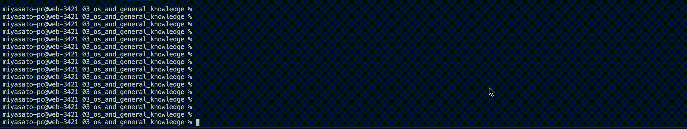
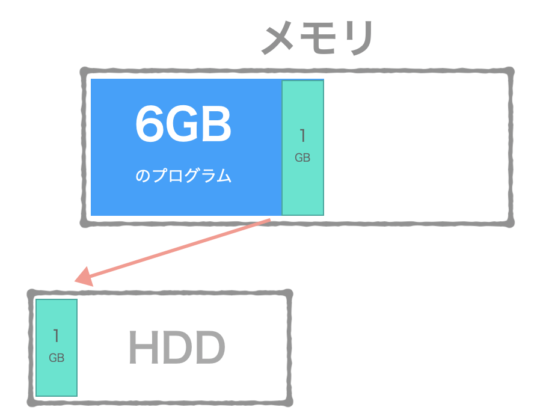

# OS and General Knowledge

- [Terminal Usage](#terminal-usage)
- [How OSs work in General](#how-oss-work-in-general)
- [Process Management](#process-management)
- [Threads and Concurrency](#threads-and-concurrency)
- [Basic Terminal Commands](#basic-terminal-commands)
- [Memory Management](#memory-management)
- [I/O Management](#io-management)

## Terminal Usage

- `command + n`で新規ウィンドウ
- `command + t`で新規タブ

### ユーザモード

- 一般的なUNIX系のシステムでは、ユーザはスーパーユーザと一般ユーザに分けられる。  
- スーパーユーザはあらゆる操作が可能で、ユーザー名はrootに決められている。  
- macOSでは、デフォルトでrootにログインしたり、一時的にrootに移行して操作するといったことが出来ないようになっているため、**sudo**というコマンドを利用して、一時的にスーパーユーザの権限を取得し、コマンドを実行している。

### SIP(System Integrity Protection)

- sudoコマンドを使えばシステムに対してあらゆる操作が行えるため、システムに重大な影響を与えてしまう可能性がある。  
- そのため、SIPと呼ばれる仕組みで、スーパーユーザであってもシステムの重要なディレクトリ内の書き換えが出来ないようになっている。  
例えば、下記のディレクトリ以下はsudoコマンドを使っても変更することができないようになっている。（表示は可）

- `/System`
- `/bin`
- `/sbin`
- `/user`

これらを書き換えたい時はリカバリーモードで起動して、`csrutil`コマンドを使う。  
ターミナルのデザインや書式設定は環境設定からどうぞ。  

### プロンプトの変更

プロンプトの書式は、デフォルトでは「`ホスト名：現在のディレクトリ名 ユーザ名$`」になっているが、  
必要に応じてこの書式を変更することが出来る。  

プロンプトの書式は、シェル変数「PS1」で定義されている。  
例えば、`ホスト名：現在のディレクトリ名 ユーザ名$` 👉 `\h:\W \u\$` といった書式で設定されている。  
書式で使えるエスケープ文字は以下の通り。  

| エスケープ文字 | 意味 |
| --- | --- |
| `\H` | ホスト名 |
| `\h` | ホスト名(現在の.まで) |
| `\W` | 現在のディレクトリ名 |
| `\w` | 現在のディレクトリ（フルパス） |
| `\u` | 現在のユーザー名 |
| `\$` | $は変数を表すので、$を表示させたい場合は\$のようにエスケープ |
| `\T` | 時刻 HH:MM:SS 形式 (12時間) |
| `\t` | 時刻 HH:MM:SS 形式 (24時間) |

一時的にプロンプトを変更するには、以下のようにPS1に書式を指定する。  
`PS1="\W \$ "  #現在のディレクトリ名 $`  
上記の場合、ターミナルを再起動すると設定が戻ってしまうので、設定を保存するには~/bashrcなどに設定を記述する。  

### コマンド履歴

- 実行したコマンドはコマンド履歴として保存される。  
- `history [表示するコマンド数]`で過去に実行したコマンドの一覧を表示することが出来る。引数なしだと最大500個。  
- 表示したコマンドの中から、`![コマンド番号]`のように、番号を指定してコマンドを実行することができる。  
- `!!`と実行すると、直前に実行したコマンドを再実行することができる。  

#### インクリメンタルサーチ

- コマンド履歴の中から特定のコマンドを検索するには、`control + r`を押してインクリメンタルサーチというモードに切り替える。  
- `` (reverse-i-search)`': `` と表示され、続けて検索するコマンド名を入力すると、新しい方から古い方に向かって入力したコマンドが検索され、表示される。  
- `control + r`を押し続けていると、同じ文字列を含む次に古いコマンドが検索される。  
- `esc`でコマンドがプロンプトの後に入力された状態になるので、そこから実行が可能。  

#### マーク機能

過去に実行したコマンドの結果などを確認したい時に、マークやブックマーク機能が便利。  
それぞれ設定されているマークやブックマークの位置に移動することが出来る。  

- 角括弧`[]`：マーク
- 縦線`|`：ブックマーク

ターミナルの設定で自動的に各プロンプトの行を自動的にマークする他、  
マークしたい行を選択して、ショートカットメニューから「マーク」(`command + u`)を選択。  
マークを削除したいときには、ショートカットメニューから「マークを解除」(`shift + command + u`)を選択。  

ブックマークは、マークに名前を設定出来るようにしたもので、動作としても重みのある「マーク」。  
ブックマークを挿入するには、ターミナルのメニューから「ブックマークを挿入」(`shift + command + m`)を選択。  

マークやブックマークの位置に移動するには、ターミナルメニューの「編集」👉「移動」から選択する他、  
以下のショートカットキーが使用できる。  

- 前のマークへジャンプ(`command + ↑`)
- 次のマークへジャンプ(`command + ↓`)
- 前のブックマークへジャンプ(`option + command + ↑`)
- 次のブックマークへジャンプ(`option + command + ↓`)

### ディレクトリを表す記号

| 記号 | 意味 |
| --- | --- |
| ~(チルダ) | ホームディレクトリ |
| ~-(チルダとハイフン) | 直前にいたディレクトリ |
| .(ドット) | カレントディレクトリ |
| ..(ドット２つ) | 1つ上のディレクトリ |

### ワイルドカード

| 記号 | 意味 |
| --- | --- |
| * | 任意の文字列（長さ0以上の文字列）とマッチ |
| ? | 任意の1文字とマッチ |
| [文字] | 指定した文字（複数や範囲を指定可能）の中の１文字とマッチ |
| [^文字]または[!文字] | 指定した文字（複数や範囲を指定可能）の中以外の１文字とマッチ |

### コマンドを連続して実行

#### 実行結果に関わらず、コマンド１が終了したらコマンド2を実行( `;` )

`command1 ; command2`
> command1が失敗しても、command2は実行されます`

#### コマンド1が成功したらコマンド2を実行する( `&&` )

`command1 && command2`
> command1が成功した場合のみ、command2が実行されます。

※前のコマンドが失敗すると、次のコマンドは実行されません。

#### コマンド1が失敗した場合のみコマンド2を実行する( `||` )

`command1 || command2`
> command1が失敗した場合のみ、command2が実行されます

### UNIX系システムの主なディレクトリ

| ディレクトリ | 概要（配置されるファイル） |
| --- | --- |
| /bin、/usr/bin | 基本コマンド |
| /sbin、/usr/sbin | システム管理用コマンドなど |
| /dev | デバイスファイル |
| /etc | 設定ファイル。/private/etcのシンボリックリンク。 |
| /tmp | 一時的なファイル。ここに配置されたファイルは次回のシステム起動時には削除される。/private/tmpのシンボリックリンク。 |
| /var | 変更されるデータ。キャッシュデータ、ログファイルなど変更されるファイル。/private/tmpのシンボリックリンク。 |
| /usr/lib | ライブラリファイル |
| /usr/local | ユーザがインストールしたソフトウェアのファイル |
| /usr/share | システムに依存しない共有データファイルやドキュメント、オンラインマニュアルなど |

### macOC独自の主なディレクトリ

| ディレクトリ | 概要（配置されるファイル） |
| --- | --- |
| /Users | ユーザのホームディレクトリ。Finderでは「ユーザ」。 |
| /System/Library | macOS独自の拡張機能などのライブラリファイル。Finderでは「システム」👉「ライブラリ」 |
| /Library | アプリケーション独自の拡張機能などのライブラリファイル。Finderでは「ライブラリ」 |
| /Applications | アプリケーションのファイル。Finderでは「アプリケーション」|

### 参考

- [Mac ターミナルの基本的な使い方・操作方法（１） / Web Design Leaves](https://www.webdesignleaves.com/pr/plugins/mac_terminal_basics_01.html)

<!-- 余力があれば非同期とリダイレクトのことについて -->

## How OSs work in General

## OSとは

- オペレーティングシステム(Operating System)
- OSはアプリケーションシステム（Excel、ウェブブラウザなど）を動作させることが目的
- OSはあらゆるハードとソフトウェアを管理し、利用者が利用しやすいようにサービスしてくれるもの

## OSの構成

### ブートローダー

- コンピュータを起動したときに呼び出される、OSをロードするプログラム
- ブート（起動）ローダー（読み込む）
- 電源投入 👉 BIOS起動 👉 **ブートローダー起動** 👉 OS起動

### カーネル

- カーネル = 核
- OSの中核部分のソフトウェア
- ハードウェアの操作を一手に引き受けるソフトウェア
- プロセス管理、空間管理（メモリのユーザー空間など）、時間管理、割り込み処理、ファイルシステム、ネットワークなどの役割を担っている

### デーモン

>「デーモン」はギリシャ神話の登場人物で、 善でも悪でもなく、大雑把にいうと、 「人間のために役立つことをしてくれる小さな妖精さん」のこと。

らしい。

- OSが起動すると同時に動く**常駐プログラム**
- 例えばWebサーバー(httpd)として機能していたり、FTPサーバー(ftpd)として起動していたりする
- 上記のように、デーモンのプログラム名には`d`が付いていることが多い。

### シェル

- OSのユーザのためにインタフェースを提供するソフトフェアであり、カーネルのサービスへのアクセスを提供する。
- シェル = 外殻。カーネルとユーザの間にある外殻であることから。
- CLIのものとGUIのものがあり、CLIは操作が早かったりする一方、GUIはユーザビリティに優れ、画像や動画の操作に適している。
- Macに於いて、主なCLI（コマンドラインシェル）は「`zsh`」、GUI（グラフィティカルシェル）は「`Finder`」。

### デスクトップマネージャ

- デスクトップ環境を提供するソフトウェアのこと。  
- WIMP、ツールバー、フォルダ、背景画像、デスクトップウィジェットなどといったものから成り立っている。

※WIMP 👉 Window,Icon,Menu,Pointer

### アプリケーション

- OSだけの機能ではユーザビリティが低いため、 OSには一般のユーザーが使いやすいように様々なソフトウェアがセットになっている。
- 例えば、ファイル管理、ブラウザ、各種設定、メールなどの標準アプリケーションなど。

## Process Management

- プロセスの生成・実行・消滅を管理すること。
- OSのうちでも主に**カーネル**の機能。
- プロセス間通信や排他制御もプロセスマネジメントの役割。
- プロセスへのリソースを割り当てる機構でもある。

- プロセスとは：命令。動作中のプログラム。ソースコードや、それを実行するためのリソースも含まれる。

## Threads and Concurrency

### スレッドとは

- 処理の単位。実行の文脈とも。実行単位はプロセスよりも小さい。
- プロセスに比べて、プログラムを実行する時のコンテキスト情報が最小で済むため切り替えが早い。
- プロセスは親プロセスから子プロセスが作られ、木構造になる上に、子プロセスに仮想メモリが与えられるので、重い処理になる。
- そこで、メモリなど親子で共有できるところは共有したのが「スレッド」という実行単位。 👉 だからコンテキスト情報が最小で済む
- プロセスが複数のスレッドで構成されている場合もあり（マルチスレッド）、この場合は命令を同時に実行する。👉 並列処理や並行処理

### 並行処理とは

- ある1つの時点では1つの仕事しかしていないが、複数の仕事を切り替えることによって、同時にやっているように見せる処理方式のこと。
- 「他を待たせないこと（待ち時間を上手く使うこと）」「同時にやること」が目的。
- 実際に物理的に複数の処理を同時に実行しているわけではない（それは並列処理）。1つのCPUで高速に実行タスクを切り替えて、同時にやっているように見せているだけ。

### 並列処理とは

- 実際に物理的に複数の処理を同時に実行する処理方式のこと。
- 複数のCPUを用いて実行する。ただし、マルチコアプロセッサに対応したシステムでないと実現できないので注意。
- 単一の処理装置を用いる場合に比べ、最大で装置の数を乗じた処理性能（プロセッサ4基なら4倍）を発揮できる可能性がある。

## Basic Terminal Commands

- `$`はbash、`%`はzsh。
- Linux(GNU)とMacOS(FreeBSD)では開発元が違うため、コマンドの挙動が違うことがあるので要注意。

### grep

`grep [オプション] 検索パターン ファイル`

- ファイル内検索コマンド。
- ファイルを引数で指定しなかった場合は、標準入力から読み込む。
- オプションにより正規表現も使える。

#### 実行してみた - 普通にgrep

```zsh
% grep OS 03_os_and_general_knowledge.md
# OS and General Knowledge
macOSでは、デフォルトでrootにログインしたり、一時的にrootに移行して操作するといったことが出来ないようになっているため、  
| /System/Library | macOS独自の拡張機能などのライブラリファイル。Finderでは「システム」👉「ライブラリ」 |
## How OSs work in General
## OSとは
- OSはアプリケーションシステム（Excel、ウェブブラウザなど）を動作させることが目的
- OSはあらゆるハードとソフトウェアを管理し、利用者が利用しやすいようにサービスしてくれるもの
## OSの構成
- コンピュータを起動したときに呼び出される、OSをロードするプログラム
- 電源投入 👉 BIOS起動 👉 **ブートローダー起動** 👉 OS起動
- OSの中核部分のソフトウェア
- OSが起動すると同時に動く**常駐プログラム**
- OSのユーザのためにインタフェースを提供するソフトフェアであり、カーネルのサービスへのアクセスを提供する。
- OSだけの機能ではユーザビリティが低いため、 OSには一般のユーザーが使いやすいように様々なソフトウェアがセットになっている。
- OSのうちでも主に**カーネル**の機能。
## POSIX Basics
```

- `OS`を片っ端から検出してくれている。POSIXまで引っかかってる。

#### 実行してみた - OR検索

```zsh
% grep "bash\|zsh" 03_os_and_general_knowledge.md
上記の場合、ターミナルを再起動すると設定が戻ってしまうので、設定を保存するには~/bashrcなどに設定を記述する。  
- Macに於いて、主なCLI（コマンドラインシェル）は「`zsh`」、GUI（グラフィティカルシェル）は「`Finder`」。
- `$`はbash、`%`はzsh。
```zsh
```zsh
```zsh
```

- `bash`と`zsh`の複数パターン（OR）検索をしてくれている。
- `-E` を付けると明示的に検索パターンを正規表現として読んでくれるため、バックスラッシュが要らない。

### awk

`awk 'スクリプト' 入力ファイルのパス`

- 「オーク」と読む。コマンドラインから簡単にテキストをフィルターしたり、表示を整えたり、値を集計したりできる。
- ポイントは「コマンドラインから簡単にテキストを操作する」こと。コマンドラインから出力したテキストをその場で処理するのに大変便利。
- コマンドっぽく使えるだけで、正確にはコマンドではなく「AWKスクリプト・インタプリタ。」
- スクリプトの箇所は「パターン文」と「アクション文」から成り立つ。
- `awk 'パターン文 {アクション文}' 入力ファイルのパス`

#### 組込変数

| 名称 | 説明 | デフォルト値 |
| --- | --- | --- |
| $0 | レコード全体 |
| $n | レコード(列)のn番目 |
| RS | Record Separator - 入力のレコード区切り文字 | 改行 |
| FS | Field Separator - 入力のフィールド区切り文字 | 連続するスペースorタブ文字 |
| ORS | Output Record Separator - 出力のレコード区切り文字 | 改行 |
| OFS | Output Field Separator - 出力のフィールド区切り文字 | スペース１つ |
| NR | Number of Record - 現在のレコード数 |
| NF | Number of Field - 現在のレコードのフィールド数 |

#### 実行してみた - 入力ファイルの中身を出力

```zsh
% awk '{print NR "\t" $0}' 02_basic_frontend_knowledge/sample.html
1       <!DOCTYPE html>
2       <html lang="ja">
3       <head>
4         <meta charset="UTF-8">
5         <meta name="viewport" content="width=device-width, initial-scale=1.0">
6         <link rel="stylesheet" href="style.css">
7         <link href="https://fonts.googleapis.com/css2?family=Kosugi+Maru&family=M+PLUS+Rounded+1c:wght@300;800&display=swap" rel="stylesheet">
8         <title>Developer Roadmap</title>
9       </head>
10      <body>
11        <div class="main">
12          <div class="card">
13            <h1 class="title">フォームに入力した文字を下に表示するやつ</h1>
14            <form action="#">
15              <input type="text" id="input_message" class="textbox">
16              <input type="button" class="btn_submit" value="送信" onclick="getInput()">
17            </form>
18            <p id="output_message" class="output_message"></p>
19            <script src="getInput.js"></script>
20          </div>
21        </div>
22      </body>
23      </html>
```

- `NR "\t"`で行番号を表示させることが可能。

#### 実行してみた - パターン一致

```zsh
% awk '/meta/ {print $0}' 02_basic_frontend_knowledge/sample.html
  <meta charset="UTF-8">
  <meta name="viewport" content="width=device-width, initial-scale=1.0">
```

- パターンは正規表現で。

#### 実行してみた - 集計

例えば、rootが起動しているプロセスのCPU使用率合計が知りたい時。  
まずは全てのプロセスとCPU使用率を表示。

```zsh
% ps aux
USER               PID  %CPU %MEM      VSZ    RSS   TT  STAT STARTED      TIME COMMAND
miyasato-pc       1461  84.1  3.8  9111452 1266244   ??  S     9:32AM 325:54.66 /Applications/Snap Camera.app/Contents/MacOS/Snap Camera
miyasato-pc       3848  16.5  0.7 25628312 242376   ??  S     2:00PM   3:35.13 /Applications/Google Chrome.app/Contents/Frameworks/Google Chrome Framework.framework/Versions/84.0.4147.89/Helpers/Google Chr
〜〜〜
〜〜〜
miyasato-pc       3896   0.0  0.0  4341312   2468   ??  S     2:05PM   0:00.01 /System/Library/PrivateFrameworks/ToneLibrary.framework/Versions/A/XPCServices/com.apple.tonelibraryd.xpc/Contents/MacOS/com.a
```

この出力を保存してrubyなり何なりで手を加えても良いが、awkを使うと全表示も含め1行で済む。

```zsh
% ps aux | awk '$1 == "root" {s += $3} END {print s}'
0.4
```

平和。

### sed

`sed [オプション] スクリプトコマンド 入力ファイル`

- **Stream EDitor**の略で、指定したファイルをコマンドに従って処理し、標準出力へ出力する。
- コマンドと対象となる「スクリプト」によって、テキストファイルを編集するコマンド。テキストファイルに直接手を加えるわけではない。(-iオプションをつけたら直接編集して上書き)
- 例えば、「`sed s/abc/ABC/ ファイル名`」で、指定したファイル内の「`abc`」を「`ABC`」に置き換えることができるが、この「`s/abc/ABC/`」部分が、sedのスクリプト。
- `s`は「置換する」というコマンドで、それ以下が正規表現。区切り記号の「` / `」は他の記号でもよく、パスの置換などで置換対象に「` / `」が含まれている場合は、「` ! `」など他の記号を使ったほうが便利。
- パイプラインやリダイレクトを活用するのが一般的。

#### 実行してみた - binをBINに置き換えて出力

```zsh
% cat /etc/shells | sed s/bin/BIN/
# List of acceptable shells for chpass(1).
# Ftpd will not allow users to connect who are not using
# one of these shells.

/BIN/bash
/BIN/csh
/BIN/dash
/BIN/ksh
/BIN/sh
/BIN/tcsh
/BIN/zsh
```

- `sed s/bin/BIN/ /etc/shells`でも同様の結果。

### lsof

- 「**LiSt Open Files**」（開いているファイル群を列挙する）
- 「プロセスが開いているファイル」を表示するコマンド。
- >UNIX／Linuxでは、一般的なファイルだけでなく、ネットワークソケットやデバイスドライバー、プロセス情報なども「ファイル」として扱います。そのため、開かれているファイルを調べることで、待機ポートやネットワークのマッピング情報などを把握できます。
- >lsofコマンドによって「あるファイルを開いているプロセス」「あるポートにアクセスしているプロセス」を特定し、「不要なプログラムが実行されていないか」「不正なプログラムが動作していないか」を調べることができます。
- FDはファイルディスクリプタのこと。プログラムがアクセスするファイルや標準入出力などをOSが識別するための識別子。0〜2は標準入出力で、それ以外のプロセスは3以降から割り当てられる。

#### 実行してみた - TCP通信のプロセスを調べる

```zsh
% lsof -iTCP
COMMAND     PID        USER   FD   TYPE            DEVICE SIZE/OFF NODE NAME
Notion      507 miyasato-pc   47u  IPv4 0x8e0459f36a5232d      0t0  TCP 10.10.111.55:64149->104.18.23.110:https (ESTABLISHED)
Notion      507 miyasato-pc   73u  IPv4 0x8e0459f3696294d      0t0  TCP 10.10.111.55:62415->ec2-34-237-73-95.compute-1.amazonaws.com:https (ESTABLISHED)
Slack\x20   568 miyasato-pc   20u  IPv4 0x8e0459f295bd58d      0t0  TCP 10.10.111.55:61889->ec2-18-178-165-242.ap-northeast-1.compute.amazonaws.com:https (ESTABLISHED)
~~~
~~~
Snap\x20C  1461 miyasato-pc   35u  IPv4 0x8e0459f3ac431cd      0t0  TCP 10.10.111.55:64501->nrt13s50-in-f19.1e100.net:https (ESTABLISHED)
git-crede  1884 miyasato-pc    5u  IPv4 0x8e0459f2ec791cd      0t0  TCP 10.10.111.64:50121->ec2-13-114-40-48.ap-northeast-1.compute.amazonaws.com:https (CLOSED)
com.docke  9677 miyasato-pc   25u  IPv6 0x8e0459f2bdd7c9d      0t0  TCP *:5506 (LISTEN)
com.docke  9677 miyasato-pc   26u  IPv6 0x8e0459f2bddad9d      0t0  TCP *:hbci (LISTEN)
com.docke 10342 miyasato-pc   10u  IPv4 0x8e0459f295bf32d      0t0  TCP localhost:57381 (LISTEN)
```

#### 実行してみた - ポート番号80(`http`)を使用しているプロセスを調べる

```zsh
% lsof -i:80
COMMAND    PID        USER   FD   TYPE            DEVICE SIZE/OFF NODE NAME
Google    1081 miyasato-pc   30u  IPv4 0x8e0459f2ec7af6d      0t0  TCP 10.10.111.58:56418->nrt12s23-in-f14.1e100.net:http (CLOSE_WAIT)
Google    1081 miyasato-pc   40u  IPv4 0x8e0459f36da232d      0t0  TCP 10.10.111.58:56419->p077.net027121054.biz.tokai.or.jp:http (CLOSE_WAIT)
```

- `-P`をつけるとサービス名(`http`)に変換されずポート番号(`80`)のまま表示される。

```zsh
% lsof -i:80 -P
COMMAND    PID        USER   FD   TYPE            DEVICE SIZE/OFF NODE NAME
Google    1081 miyasato-pc   30u  IPv4 0x8e0459f2ec7af6d      0t0  TCP 10.10.111.58:56418->nrt12s23-in-f14.1e100.net:80 (CLOSE_WAIT)
Google    1081 miyasato-pc   40u  IPv4 0x8e0459f36da232d      0t0  TCP 10.10.111.58:56419->p077.net027121054.biz.tokai.or.jp:80 (CLOSE_WAIT)
```

#### 補足 - TCPの状態

| 状態 | 説明 |
| --- | --- |
| LISTEN | 接続待受状態|
| ESTABLISHED | 接続が確立されている状態 |
| SYN_SENT | 接続要求(SYN)を送信した状態(応答/ACKは受けてない状態) |
| SYN_RECV | 接続要求(SYN)を受け取った状態 |
| FIN_WAIT1 | ソケットを閉じ、接続を落としている状態 |
| FIN_WAIT2 | 接続はクローズされ、ソケットはリモート側からの切断を待っている状態 |
| TIME_WAIT | 接続終了を待っている状態 |
| CLOSED | ソケットが使用されていない |
| CLOSE_WAIT | 接続相手はクローズし、自身はクローズ待ちの状態 |
| LAST_ACK | FINに対する応答(ACK)待ち |
| CLOSING | FIN_WAIT1でFINを受け取り接続が閉じられた状態 |
| UNKNOWN | 状態不明のソケット |

#### 参考文献

[プログラマーが「ネットワーク怪しくない？」と思った時に覚えておくと便利なことまとめ - LIVESENSE ENGINEER BLOG](https://made.livesense.co.jp/entry/2016/05/10/083000)

### curl

`curl [オプション] [URL]`

- URLシンタックスを用いてファイルを送信または受信するコマンドラインツールである。
- APIを叩くためによく使われるが、APIを叩くためだけに存在しているわけではない。
- HTTPやHTPSといったプロトコルに対応しているため、GETでAPIを叩いたりすることができるというだけで、
実際はFTP,SFTP,LDAP,TELNETなど多くのプロトコルに対応している。
- 明示的にリクエストメソッドを指定したい場合は`-X {リクエストメソッド} “URL”`で変更することができる。

#### 実行してみた - 取得してファイルに出力する

`curl -o example.html www.example.com`
`curl http://www.example.com/ > example.html`

- 実行結果：[example.html](example.html)

#### 実行してみた - リクエストヘッダのみ取得する「`-I`」

```zsh
% curl -I www.example.com
HTTP/1.1 200 OK
Content-Encoding: gzip
Accept-Ranges: bytes
Age: 493973
Cache-Control: max-age=604800
Content-Type: text/html; charset=UTF-8
Date: Mon, 03 Aug 2020 01:33:24 GMT
Etag: "3147526947"
Expires: Mon, 10 Aug 2020 01:33:24 GMT
Last-Modified: Thu, 17 Oct 2019 07:18:26 GMT
Server: ECS (sjc/16C5)
X-Cache: HIT
Content-Length: 648
```

- 小文字で`-i`だとレスポンスにリクエスドヘッダを含んで出力する形になる。

#### 参考

- [よく使うcurlコマンドのオプション - Qiita](https://qiita.com/ryuichi1208/items/e4e1b27ff7d54a66dcd9)
- [curlコマンドでapiを叩く - Qiita](https://qiita.com/buntafujikawa/items/758425773b2239feb9a7)

### wget

`wget [オプション] [URL]`

- ノンインタラクティブなダウンローダー。指定したURLのファイルをダウンロードする。
- 対応するプロトコルはHTTP、HTTPS、FTPのみ。
- curlにはない特徴としては、「再帰的にダウンロードできる」こと。

#### 実行してみた - webページをダウンロード

```zsh
% wget -l 1 -H -r http://www.example.com
--2020-08-03 11:49:14--  http://www.example.com/
www.example.com (www.example.com) をDNSに問いあわせています... 93.184.216.34
www.example.com (www.example.com)|93.184.216.34|:80 に接続しています... 接続しました。
HTTP による接続要求を送信しました、応答を待っています... 200 OK
長さ: 1256 (1.2K) [text/html]
`www.example.com/index.html' に保存中

www.example.com/index.html                             100%[===========================================================================================================================>]   1.23K  --.-KB/s 時間 0s       

2020-08-03 11:49:15 (133 MB/s) - `www.example.com/index.html' へ保存完了 [1256/1256]

robots.txtを読み込んでいます、エラーは無視してください。
--2020-08-03 11:49:15--  https://www.iana.org/robots.txt
www.iana.org (www.iana.org) をDNSに問いあわせています... 192.0.32.8
www.iana.org (www.iana.org)|192.0.32.8|:443 に接続しています... 接続しました。
HTTP による接続要求を送信しました、応答を待っています... 200 OK
長さ: 24 [text/plain]
`www.iana.org/robots.txt' に保存中

www.iana.org/robots.txt                                100%[===========================================================================================================================>]      24  --.-KB/s 時間 0s       

2020-08-03 11:49:16 (2.08 MB/s) - `www.iana.org/robots.txt' へ保存完了 [24/24]

--2020-08-03 11:49:16--  https://www.iana.org/domains/example
www.iana.org:443 への接続を再利用します。
HTTP による接続要求を送信しました、応答を待っています... 301 Moved Permanently
場所: https://www.iana.org/domains/reserved [続く]
--2020-08-03 11:49:16--  https://www.iana.org/domains/reserved
www.iana.org:443 への接続を再利用します。
HTTP による接続要求を送信しました、応答を待っています... 200 OK
長さ: 10336 (10K) [text/html]
`www.iana.org/domains/example' に保存中

www.iana.org/domains/example                           100%[===========================================================================================================================>]  10.09K  --.-KB/s 時間 0s       

2020-08-03 11:49:16 (59.0 MB/s) - `www.iana.org/domains/example' へ保存完了 [10336/10336]

終了しました --2020-08-03 11:49:16--
経過時間: 1.6s
ダウンロード完了: 3 ファイル、11K バイトを 0s で取得 (59.2 MB/s)
```

- 実行結果：[www.example.com/index.html](www.example.com/index.html)
- `-l 1`は階層までのリンク、`-H`は外部のサーバ（ドメイン）も含めてファイルをダウンロード、`-r`は再帰（リンク先も辿る）。
- `-o`をつけると指定したファイルに出力する。
- `robots.txt`は、botなどのクローラーに対しての制御情報が書いてあるもの。クロールする場所を制限したり、促したりしてクロール効率を向上させる。

#### 参考

- [【 wget 】コマンド――URLを指定してファイルをダウンロードする：Linux基本コマンドTips（24） - ＠IT](https://www.atmarkit.co.jp/ait/articles/1606/20/news024.html)
- [wgetでこういう時はこうする!! - Qiita](https://qiita.com/hirohiro77/items/b774908436ec032df719)

- 余談:デフォルトでwgetコマンドが入っていなくてbrewでgetしてきました。

### tail

`tail [オプション] ファイル名`

- ファイルの最後から数行、「tail(尾)」部分を表示するコマンド。
- `tail -n <行数> <ファイル名>` で、最後から何行表示するかを指定できる。
- `-f`オプションを使うと、変更をリアルタイムで監視(follow)することができる。ログファイルを追うのに便利。

#### 実行してみた - example.htmlの最後から数行を見る

```zsh
% tail example.html

<body>
<div>
    <h1>Example Domain</h1>
    <p>This domain is for use in illustrative examples in documents. You may use this
    domain in literature without prior coordination or asking for permission.</p>
    <p><a href="https://www.iana.org/domains/example">More information...</a></p>
</div>
</body>
</html>
```

- 上記より、行数指定をしない場合は最後から10行分表示するもよう。

### head

`head [オプション] ファイル名`

- ファイルの最初から数行、「head(頭)」部分を表示するコマンド。
- `head -n <行数> <ファイル名>` で、最初から何行表示するかを指定できる。
- これも`-f`で変更をリアルタイム監視することができる。

#### 実行してみた - example.htmlの頭から5行を見る

```zsh
% head -n 5 example.html
<!doctype html>
<html>
<head>
    <title>Example Domain</title>

```

- こちらもデフォルトだと10行分表示する様子。

### less

`less ファイル名`

- テキストファイルの中身を1画面で表示するコマンド。
- `コマンド名 | less`のように、別のコマンドの実行結果を1画面ずつ表示する場合にも使われる。
- 同じようなコマンドで`more`というものがあるが、それよりも機能が多く、画面内で検索したりスクロールしたりすることが可能。
- tailなどと同様、`F`入力で変更をリアルタイム監視出来る。
- 表示中に`/〇〇`で〇〇の前方検索、`?〇〇`で後方検索が出来る。`&〇〇`で検索にヒットしたものだけを表示。
- `n`を押し続けると↓側に検索が進み、`N`を押すと↑側に検索が進む。

#### 実行してみた - ページ送り、前方検索、一致したものだけ表示



#### 実行してみた - 別のコマンド(今回は`lsof`)の実行結果を1画面ずつ表示


#### 参考

- [エンジニアなら知っておきたい lessコマンドtips 11選 - Qiita](https://qiita.com/ine1127/items/64b5b6cf52471c3fe59c)

### find

`find 検索パス 検索条件 [アクション]`

- 場所を指定してファイルを検索するコマンド。
- ファイル名が分かっているが、そのファイルがどのディレクトリに配置されているか分からない場合などに役立つ。
- ファイル名だけではなく、ファイルの種類や更新日時など、細かい条件を指定して検索することができる。

#### 実行してみた - ディレクトリの中身を検索

```zsh
% find 03_os_and_general_knowledge
03_os_and_general_knowledge
03_os_and_general_knowledge/0803_less.gif
03_os_and_general_knowledge/www.example.com
（略）
```

#### 実行してみた - 現在のディレクトリ(developers-loadmap)以下の*.mdファイルを検索

```zsh
% find ./ -name "*.md" -type f
.//03_os_and_general_knowledge/03_os_and_general_knowledge.md
.//README.md
.//02_basic_frontend_knowledge/02_basic-frontend-knowledge.md
.//01_internet.md
```

#### 実行してみた - 「あのファイルどこにあったっけ？」

```zsh
% find . -type f -name "example.html" -print
./03_os_and_general_knowledge/example.html
```

- `-name`でファイル名指定のオプション。後続のファイル名にはワイルドカードも指定可。
- `-type`はファイル形式を指定するオプション。後続の`f`はファイル、`d`はディレクトリを表す。
- `-print`で対象となっているファイルのパス名を標準出力に出力して改行してくれる。
- 他にもユーザ名で検索できたり(`-user`)、診断用の情報（デバッグ情報）を出力できたりする(GNU版のみ)。

### ssh

`ssh ユーザー名@ホスト名 -i 秘密鍵ファイルのパス -p ポート番号`

- 言わずと知れたssh(Secure SHell)コマンド。暗号化された通信を使って安全にリモート接続をする。
- 主にサーバにアクセスするときに使われる。AWSにログインするときに使ったような気がする。
- オプションを毎回つけるのが面倒な場合は、`~/.ssh/config`に以下のように接続先の情報を書いておくと  
`ssh ホスト名`だけで接続できる。便利。

  ```text
  Host [ホスト名を好きな名前で]
    HostName    [ホスト名: IPアドレスなど]
    Port              [ポート番号: 22など]
    IdentityFile   [鍵ファイルのパス: ~/.ssh/鍵ファイル名など]
    User             [接続する際のユーザー名]
  ```

### kill

`kill [シグナル] プロセスID`

- IDを指定してプロセスやジョブを殺す（終了させる）コマンド
- 大体「`ps`でPIDを調べる→`kill`」の流れ。
- シグナルで`-HUP`(1)をつけると終了後再起動、`-KILL`(9)をつけると強制終了させる。

#### シグナルと呼ばれるオプション的な物がある

| 番号 | シグナル | 説明 |
| --- | --- | --- |
| 1 | HUP(hung up) | 終了後再起動 |
| 2 | INT(interrupt) | ユーザーからの強制終了命令（ = Ctrl＋C） |
| 3 | QUIT | 端末からの終了命令（ = Ctrl＋\） |
| 6 | ABRT(abort) | プロセスの異常終了 |
| 9 | KILL | プロセスの強制終了 |
| 14 | ALRM | タイマーで終了？ |
| 15 | TERM | 正常な終了動作を行わせて安全に終了 |

#### Snap Cameraのプロセスを強制終了した

```zsh
% ps aux | grep Snap
miyasato-pc       2770   9.3  2.7  7961144 920924   ??  S     8:55AM  91:44.86 /Applications/Snap Camera.app/Contents/MacOS/Snap Camera
miyasato-pc       2782   0.0  0.0  4345664   2900   ??  S     8:55AM   0:04.05 /Library/CoreMediaIO/Plug-Ins/DAL/SnapCamera.plugin/Contents/Resources/AssistantService
miyasato-pc       6451   0.0  0.0  4399356    796 s001  S+   12:14PM   0:00.00 grep Snap
% kill 2770
% ps aux | grep Snap
miyasato-pc       2782   0.0  0.0  4346188   2908   ??  S     8:55AM   0:04.05 /Library/CoreMediaIO/Plug-Ins/DAL/SnapCamera.plugin/Contents/Resources/AssistantService
miyasato-pc       6466   0.0  0.0  4408572    800 s001  R+   12:15PM   0:00.00 grep Snap
```

## 補足 - chmodと権限

`chmod モード 対象`

| モード（数字） | モード（アルファベット） | 権限 |
| --- | --- | --- |
| 4 | r | 読み取り |
| 2 | w | 書き込み |
| 1 | x | 実行 |

上記の合計値を「所有者」「所有グループ」「その他」の順で入力することでパーミッションを変更することができる。

[Linuxの権限確認と変更(chmod)（超初心者向け） - Qiita](https://qiita.com/shisama/items/5f4c4fa768642aad9e06#)

## Memory Management

- コンピュータのメモリを**効率的**に管理するもの。
- メモリはOSが管理しており、必要に応じてプログラムに割り与えたり、余白をまとめたりして最適化する。
- 複数のプログラムを動かすときに生じる以下の問題を解決することが目的。
  1. 複数のプログラムを同時に実行すること。
  1. 物理メモリを効率良く管理すること。
  1. あるプログラムの暴走や異常終了が他のプログラムの実行へ影響しないこと。

### そもそも - メモリとは

- 実行中のプログラムやデータなどを一時的に保存する場所。よくパソコン内の作業台として例えられる。
- 一時的に保存するだけなので、電源を落とすと内容は消える。別名「短期記憶領域」。
- メモリ内の箱につけられている名前を「アドレス」と呼ぶ。

### 具体的にどう管理するか - 仮想記憶

- メモリっぽく見せたハードディスクの一部分のこと。または、プログラムから見たメモリのこと。
- メモリの内容の一部をハードディスクに一時的にしまうことで、実際の物理的なメモリより大きな領域があるとプログラムに錯覚させる手法。
- 譲り合いの精神で効率的に複数のプログラムを実行させるためのもの。
- 例えば
  1. 10GBの物理メモリと6GB、5GB使用するプログラムがあった時に、物理メモリ10GBだけだと同時に実行できない
  
  2. 6GBのうちあまり使用しない1GBをハードディスクに退避させておけば
  3. 5GBのプログラムも同時に実行できる。
- →プログラムから見ると実質11GBあるので、仮想記憶は11GBということになる。

### キーワード

- ページング（方式）：仮想記憶の手法の一つ。メモリ領域を「ページ」と呼ばれるある一定の領域に分け、物理メモリとは別に仮想的なアドレスを割り当てて管理する方法。
  - ページアウト（スワップアウト）：不要なページをハードディスクに書き出して物理メモリから削除すること。
  - ページイン（スワップイン）：必要なページをハードディスクから読み出して物理メモリに配置すること。
  - ページフォールト：プログラムが物理メモリ上に存在しないページにアクセスしようとした時に起こるエラー。
- ガベージコレクション：プログラムが使わなくなったメモリ領域を自動的に開放し、空き容量として再利用出来るようにする。言語に備わっている機能。この機能を実行するプログラムのことを「ガベージコレクタ」と呼ぶ。

## Interprocess Communication

- プロセス間通信：コンピュータの仕組みにおいて、複数プロセス間でデータをやりとりすること。
- 基本的に、実行中のプロセスには専用のメモリ空間が割り当てられ、他のプロセスのメモリ空間にアクセスすることが出来ない。
- そのため、他のプロセスと情報を共有したいときには、共有メモリなどを利用し、プロセス間通信を実現する。

### データをやりとりする方法（一部）

1. 共有メモリ

- メモリ空間上に共有する領域を確保する方法。
- 保護機能を持たないため動作は高速であるが、整合性をもたせる場合には工夫が必要。

1. セマフォ

- どんな場合でも情報を常に同一の状態と内容に保つことを「同期」と呼ぶが、これを実現するための手段。
- セマフォ変数を複数のプロセスで共有することにより、資源の利用が可能かどうかを定める。

1. ソケット通信

- 各プロセスでソケットを一つずつ作成し、それを介して通信を行う手法。
- 通信プロトコルにはUDP/IPとTCP/IPが使用できる。
- TCP/IPの場合、ソケットの使い方が多少煩雑になる代わりに、信頼性のある通信を確立できる。

### 参考

- [I-6-10. プロセス間通信 | 日本OSS推進フォーラム](http://ossforum.jp/node/535)
- [ソケット、パイプ、共有メモリ…IPC（プロセス間通信）の最適な手段を模索してみた | Engineer with Freedom](https://earlyfield.com/2018/11/12/post-1526/)

## I/O Management

- コンピュータ本体と入出力装置との間での入出力の管理のこと。
- CPUの処理速度に比べて入出力装置の動作速度は非常に遅いため、これを効率的に管理して全体の処理効率を上げる。

### ドライバ

- 入出力装置は「ドライバ」と呼ばれるプログラムを通してOSで管理される。
- ドライバはOSに合わせて装置を制御してくれるため、異なるOSで装置を接続しようとした時に、差異を吸収してくれる役割を持つ。

### スプーリング

- 例えば、プリンターのような低速な入出力装置への入出力データを、ディスクなどの高速な外部記憶装置を経由させて実行する機能のこと。
-　データを直接入出力するのではなく、バッファを経由させることによって、コンピュータ本体と入出力装置を並行処理させて性能を向上させる「バッファリング」の一種。

### キーバッファ

- キーボードからの入力を一時的にメモリに保存しておくこと。
- CPU負荷の高い処理があると、キーボードからの入力を受け取れなくなってしまう場合がある。その際、キーボードからの入力を一旦キーバッファに蓄えておき、CPUに順次送り出すことで、入力を確実に受け取れるようにする機能。
- PC動作が重い時など、時々入力にタイムラグが生じながらも入力できるのは、多分これのおかげ。

### 参考

- [入出力管理 | ITの基礎知識｜ITパスポート・基本情報](https://basics.k-labo.work/2017/10/19/%E5%85%A5%E5%87%BA%E5%8A%9B%E7%AE%A1%E7%90%86/)
- [入出力管理＜ＯＳ＜ハードウェアとソフトウェア＜Ｗｅｂ教材＜木暮仁](http://www.kogures.com/hitoshi/webtext/hs-io-control/index.html)

## POSIX Basics

### stdin

### stdout

### stdrr

### pipes

## Basic Networking Concepts
