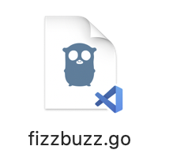
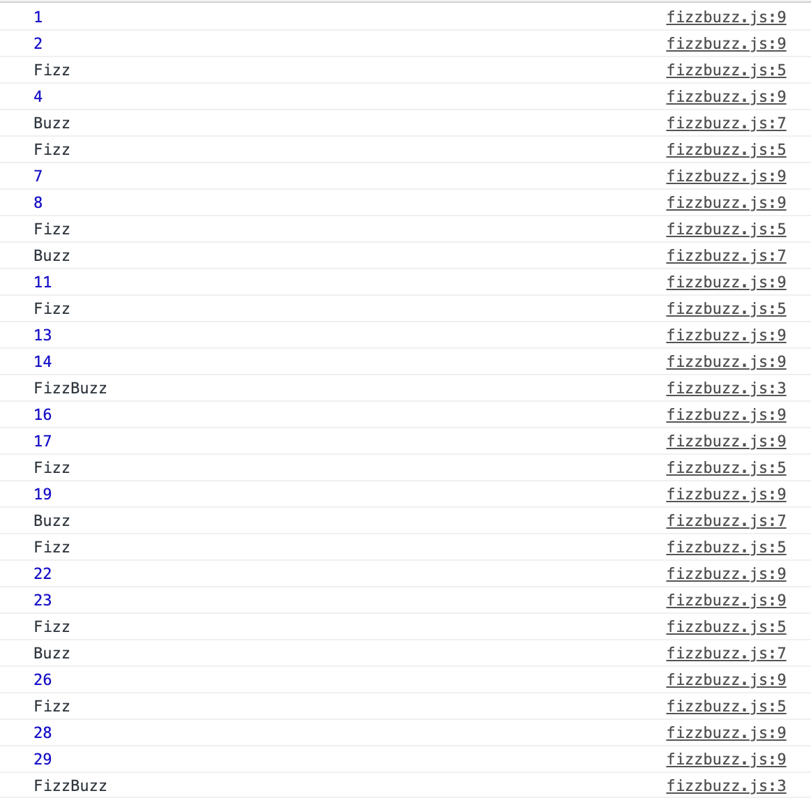

# Learn a Language

## プログラミング言語とは

- コンピュータにプログラムを記述するための形式言語。
- 計算機は、「機械語」と呼ばれるCPUが理解できる命令を実行することで動作する。しかし、人間が機械語を扱うことは非常に難しく現実的ではないため、より人間が扱いやすい手段としてプログラミング言語が用いられる。
- ある程度の間違いや曖昧さは文脈や状況から補完される自然言語と違い、コンピュータが曖昧さなく解釈できるように設計されている。
- そのため、多くの場合構文上の間違いは許されず、人間はプログラミング言語の文法に厳密に従った文を入力しなければならない。

### 型システム

- データ型を型理論に基づいてどう分類し扱うかを示すもの。なお、内部的には、全てのデータはバイナリで保持される。
- 型のある言語は、それぞれの値のデータ型に応じて、定義されていない操作が実行されないようチェックされるような機構を持つ。
  - e.g.文字列を数値で割ることは出来ないため、そのような処理があった場合にはコンパイルを失敗させる
- 型のない言語（アセンブラなど）は、任意のデータに任意の操作が可能であり、データはある長さのビット列として扱われる。

### 静的型付け

- 静的型付け言語では、すべての式の値はそのプログラムを実行する前（大体コンパイル時）に決定される。
- 型を明記する場合と型推論を行う場合とがある。前者では、プログラマは適切な位置に型を明記しなければならず、後者はコンパイラが式の型を文脈から推論する。
- 完全な型推論の静的型付け言語は主流ではない言語に使われているが、型を明記する言語でも部分的な型推論をサポートしている場合が多い。

### 動的型付け

- 動的型付け言語では、型の安全性は実行時に検査される。こちらは式や変数の型を明記する必要はない。
- プログラム実行中に異なる型の値を格納することも可能。
- コードを実際に実行してみるまで型の間違いを検出することができず、デバッグがやや難しい。

### 強い型付けと弱い型付け

- 強い型付けの言語は、処理や演算が間違った型の引数を取ることを禁止するもの。
- 縛りが多い反面、検査を通れば安全さが保証される。
- 弱い型付けの言語は、間違った方の引数を取った場合でも、言語が型の暗黙的な変換をしてしまう。
- 柔軟な表現が出来る代わりに、検査を通っても安全さは保証されないというデメリット付き。

※ ここでいう「安全さ」とは、プログラムが言語仕様で定義されていない状態にならないこと。

### 処理系：プログラムの実装のことを「言語処理系」と呼ぶ

- コンパイラ：ソースコードなどの入力を中間表現(3番地コード、時にはC言語)などの、より機械が解釈しやすい表現に変換する処理系。
- インタプリタ：入力されたプログラムを解釈実行する処理系。

### 余談・参考

- 3番地コードは「2つの入力と1つのアドレス（メモリまたはレジスタ）を指定する形式」であることから。
- [プログラミング言語 - Wikipedia](https://ja.wikipedia.org/wiki/%E3%83%97%E3%83%AD%E3%82%B0%E3%83%A9%E3%83%9F%E3%83%B3%E3%82%B0%E8%A8%80%E8%AA%9E)
- [コンパイラの中間表現いろいろ - Qiita](https://qiita.com/takoeight0821/items/073ff1333d1b019f4420)
- [3番地コード - Wikipedia](https://ja.wikipedia.org/wiki/3%E7%95%AA%E5%9C%B0%E3%82%B3%E3%83%BC%E3%83%89)
- [「強い型付け」「弱い型付け」って言葉を知った! – Chomado's Blog](https://chomado.com/programming/type-safety/)

## JavaScript

選定理由：GitHubやStackOverFlow Surveyなどで人気の言語No.1を獲得し続ける人気の言語で、バックエンドのWebエンジニアになるにあたり、使用する場面も多いと考えたため。

- プロトタイプベースのオブジェクト指向スクリプト言語。と言いつつ、最近はクラス構文などのクラスベースに見られる機能も取り込んでいる。
- 基本静的であるWebページを動かすために作られた言語で、誰でも簡単に書けるのが特徴。
- JSをサーバーサイドでも使えるようにする「node.js」と呼ばれるプラットフォームもある。フロントとサーバ、同じ言語使えたら便利じゃね？という発想から。
- ECMAという団体が標準化しており、その仕様のことをECMAScriptと呼ぶ。ES5とかES6とか。最新版はブラウザが対応しきれないのであんまり使われない。

### 補足

- プロトタイプベース：オブジェクトは、プロトタイプ（原型）となるオブジェクトに独自の特徴を付加することで生成する、という考え方。
  - 最近のJSはクラスベースの機能も盛り込んでいるが、裏ではプロトタイプベースで動いていることは変わらない。
- オブジェクト指向：プログラムを手順としてではなく、モノ（オブジェクト）の作成や操作として見る考え方。
- スクリプト言語とは、プログラミング言語の中でも、プログラムの記述や実行を比較的簡易に行うことができる言語の総称。

### JavaとJavaScript

- Javaと名前が半分一緒だが、全く異なる言語。ハムとハムスターくらい違う。
- JavaScriptは元々LiveScriptという名前で、Javaとは全くの別物だったが、JS誕生当時Javaが脚光を浴びていたことと、JS作成者の会社とJava作成社が業務提携していたことから、Java人気にあやかる形でJavaScriptと名前を変えてしまった。
- 作成者から構文からコンセプトから何から何まで違う。名前とプログラミング言語ということしか共通点がない。

### 並列処理と並行処理

- `Promise`や`async`/`await`構文で、非同期処理を実装できる。これにより、並行処理が可能。処理の順番を変えているだけで同時に処理をしているわけではない点に注意。
- 複数スレッドを用いた並列処理も可能。JS単体だとシングルスレッドなので使えない（Webページはシングルスレッド）が、webworkerというAPIを使うと実装できるようになる。

### 参考

- [JavaScript - Wikipedia](https://ja.wikipedia.org/wiki/JavaScript)
- [JavaScriptとECMAScriptの違いって何？その背景を徹底解説！ | 侍エンジニア塾ブログ（Samurai Blog） - プログラミング入門者向けサイト](https://www.sejuku.net/blog/101695)

## Ruby

選定理由：生まれ故郷島根県松江市がRubyの聖地だということと、現状一番好きな言語なので。

- まつもとゆきひろにより開発されたオブジェクト指向スクリプト言語。
- 「Perl(Pearl)に続く」言語になる、という意味で、パールが誕生石である6月の次の月、7月の誕生石であるルビーから名付けられた。
- Rubyの言語仕様策定において、最も重要なのは「ストレスなくプログラミングを楽しむこと」。Rubyほど「楽しさ」に焦点を当てた言語は他にない、らしい。確かにRuby書いてるときが一番楽しいかもしれない。

### 特徴

- 動的型付けのため型宣言が不要、記述の自由度が高い。
- gemと呼ばれるライブラリ群が充実しているため、Webシステム以外の開発も可能。非常に汎用性が高い。
- 実行環境はエンジンさえあれば動くので、WindowsでもMacOSでもLinux上でも動作する。
- 処理系はインタプリタ方式。書きながら動作確認が出来る。

### 聖地

- 島根県松江市だけがRubyの聖地なわけではない。以下２箇所もRubyの聖地と呼ばれている。
- 静岡県浜松市：MatsがRubyの開発を始めた会社の研究所がある場所
- 愛知県名古屋市：Rubyを公開した時に在籍していた会社がある場所

## Go

選定理由：プログラミング言語別年収ランキングで1位を取っているのをよく見かけるので。流行ってるしかじりたい。

- 2009年、Googleにて、UTF-8の開発者ケン・トンプソンさんや、UNIX、UTF-8の開発者ロブ・パイクさんによって設計された。オープンソースの言語。
- 「プログラミングは楽しくあるべき」という思想から生まれた言語。Rubyと友達になれそう。
- C言語に似てる。静的型付け、コンパイル言語、メモリ安全性、GC、構造的型付けなどの特徴を持つ。

### 特筆すべき特徴

- 速い：処理速度がなんとC言語の50倍！消費リソースも少なく、Javaの30分の1で済む。
- 並行処理：Goルーチン（コルーチン）というシンプルな並行処理のしくみがあり、それを用いてサクッと実装可能。
- クロスコンパイル：Macで開発していても、Windows、Linux用のバイナリが作れる。
- 誰が書いても綺麗：そもそも書き方のルールが厳密な上、`go fmt`という自動整形ツールが標準搭載されているため、書き方に個人差が出づらい。

### 用途

- Webサーバ構築、アプリケーション開発、CLI開発などに使われる。
- 特にWebサーバは、youtubeのサーバにGoが採用されているぐらい、サーバの構築がスムーズ。
- ちなみにDockerもGoで書かれている。

### 参考

- [Go (プログラミング言語) - Wikipedia](https://ja.wikipedia.org/wiki/Go_(%E3%83%97%E3%83%AD%E3%82%B0%E3%83%A9%E3%83%9F%E3%83%B3%E3%82%B0%E8%A8%80%E8%AA%9E))
- [Go言語入門 - とほほのWWW入門](http://www.tohoho-web.com/ex/golang.html)
- [Go言語とは？｜その特徴と学習するメリット](https://products.sint.co.jp/topsic/blog/go-language-overview)
 - [動的言語だけやってた僕が、38日間Go言語を書いて学んだこと - Qiita](https://qiita.com/suin/items/22662f43b6a6e8728798)

## 書いてみよう - Go

### コーディング規約

- インデントにはハードタブ（タブ文字）を利用し、ソフトタブ（半角スペース）を使用しない。
- 1行あたりの文字数に制限はない。
- 連続した変数定義やコメントは縦に揃える。

```Go
type T struct {
  name    string // name of the object
  value   int    // its value
}
```

- 演算子の前後にスペースを入れない。演算子の優先順位を明確にするときだけスペースを入れる。括弧は使わない。

```Go
x<<8 + y<<16
x, y = y, x+y
```

- 命名規則
  - 非公開メソッド、フィールド: mixedCaps（小文字で始める）
  - 公開メソッド、フィールド: MexedCaps（大文字で始める）
  - コンストラクタ: New + 生成対象の構造体名（e.g.NewBook）
  - １つのメソッドを持つインタフェース: Reader（Read メソッドだけを持つインタフェース）

### Let's FizzBuzz

> コード

```Go
package main

import "fmt"

func main() {
  for i := 1; i <= 30; i++ {
    if i%15 == 0 {
     fmt.Println("FizzBuzz")
    } else if i%3 == 0 {
     fmt.Println("fizz")
    } else if i%5 == 0 {
     fmt.Println("buzz")
    } else {
     fmt.Println(i)
    }
  }
}
```

> 実行結果

```zsh
1
2
fizz
4
buzz
fizz
7
8
fizz
buzz
11
fizz
13
14
FizzBuzz
16
17
fizz
19
buzz
fizz
22
23
fizz
buzz
26
fizz
28
29
FizzBuzz
```

- 感想
  - `go run`でコンパイルと実行を一括でやってくれるのすごくありがたい。
  - `go fmt`でソフトタブ全部ハードタブに置換してくれて感動した。
  - while文が無い！シンプルで良いですね。
  - macのfinderでgoファイルのサムネイルがあのキャラクターのシルエットになってて可愛い。

  

## 書いてみよう - Ruby

### コーディング規約

- Rubyの正式なコーディング規約はない。（！）
- ただし、チーム開発や継続的なメンテナンスが必要とされるシステム開発などにおいては、コーディングスタイルを統一した方が可読性が上がって保守性が向上するため、チーム内で一つ規約を定めておくと良い。
- 代表的な規約だと以下辺り。
  - 1行80桁まで。
  - インデント幅は半角スペース2つ、タブはNG。
- [クックパッドで使われているコーディング規約](https://github.com/cookpad/styleguide/blob/master/ruby.ja.md)とか、有名なところで使われている規約などはgithubに落ちてたりするので、そちらを参考にするのも良い。

### Let's FizzBuzz

> コード（実行結果は省略）

```Ruby
(1..30).each do |i|
  if i % 15 == 0
    p 'FizzBuzz'
  elsif i % 3 == 0
    p 'Fizz'
  elsif i % 5 == 0
    p 'Buzz'
  else p i end
end
```

- 感想
  - importとかmain()とか書かなくて良いのが大変に楽
  - 1行目から書けるしGoの半分以下の行数で終わって楽しい✌

## 書いてみよう - JavaScript

### コーディング規約

- インデントは2または4つのスペース、またはタブ記号を使用、お好みで。最近はスペースが一般的。
- 1行は80または120文字まで。
- ブロックの波括弧は同じ行に書く"エジプト"スタイル。カッコの前にはスペースを。
- 複数の文がある場合には、カッコ内の各文ごとに行を分けるのが好ましい。

※ すべての規約は絶対ではなく、コーディングの好みであるため、変更可！

### Let's FizzBuzz

> コード

```JavaScript
for (let i=1; i<=30; i++) {
  if(i % 15 == 0) {
    console.log("FizzBuzz");
  } else if (i % 3 == 0) {
    console.log("Fizz");
  } else if (i % 5 == 0) {
    console.log("Buzz");
  } else {
    console.log(i);
  }
}
```

> 実行結果



- 感想
  - 元々そういうものとはいえ、htmlも用意しないと出力が見れないのが面倒。
  - node.jsを使えばターミナルで出力できるらしい。
  - とはいえこれも1行目から書けるところがすき💮

## CLIを作ってみよう

- 今まで本格的に使ったことがない言語なので、Goで作ってみようと思います。

### 仕様

### 使い方
