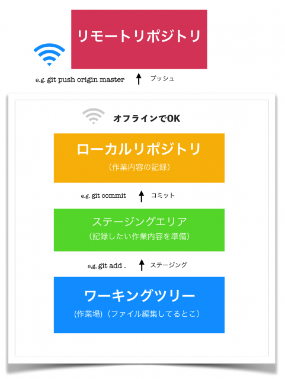

# バージョン管理とは

編集時点ごとで変更内容を管理することを「**バージョン管理**」と呼ぶ。が、

- ファイルを編集前の状態に戻したい時。
- 大昔に消したファイルを復活させたい時。

そんな時、ファイル名やディレクトリ名で編集した日付を残し管理するのは、ものすごく大変。
（e.g.「【最終版】201204_ドキュメント.docx」「201204_ドキュメント_修正版.docx」「201204_ドキュメント_最新版.docx」「201204_ドキュメント_最新版の修正版.docx」）

また、

- 複数人で1つのファイルを編集したい時。

こういうときも、お互いが編集するタイミングによって、先に編集した人の変更内容が消えてしまうかもしれない…

と、悩みが尽きない。

### そんなあなたに、**バージョン管理システム**

先述のような場面で、バージョン管理を便利にしてくれるシステムがこれ。

- ファイルの状態を好きなときに更新履歴として保存
- 他人の編集した最新ファイルを上書きしようとした時に警告を出す

これにより、バージョン管理の困りごとを解消してくれる。

# Gitの概要

現在一番有名であろうバージョン管理システム、**Git**。

バージョン管理システムは主に２つに分かれる。

- 分散型：各個人のPCというデータベースでソースコードを管理する
- 集中型：1つのリポジトリにソースコードを集めて管理する

Gitは、**分散型**に分類されるバージョン管理システムである。

- 分散型と呼ばれる理由は、ネットワークにアクセスできないなどの理由でリモートリポジトリにアクセスできない環境でも、履歴の調査や変更の記録といったほとんどの作業を行うことができることから。
- `.git`の中にある謎の大量のオブジェクトがその正体。

## ブランチとは

作業履歴の流れを分岐して記録していくもの。枝分かれした歴史。よくパラレルワールドに例えられる。

### 特徴

- 分岐したブランチの内容は他のブランチの影響を受けないため、同じリポジトリで複数の変更を同時に進めることが出来る。
- 分岐したブランチは併合することができる。(👉 merge)
- 作業単位で履歴を残すことにより、問題が発生した場合に原因となる箇所の調査や対策が容易

> ソフトウェアの開発では、ひとつのソフトウェアに対して複数のメンバーが同時に機能追加を行ったり、バグ修正を行ったりといったことがある
>
> また、複数のリリースバージョンが存在する状態で、それぞれを保守しなければならないといったこともある

上記のような、並行作業を求められる作業を支援するための機能がブランチ。

## ローカル（リポジトリ）とリモート（リポジトリ）

### そもそもリポジトリとは

ファイルやディレクトリの状態を記録する場所。

- 例えば前述の「【最終版】201204_ドキュメント.docx」を、「ドキュメント.docx」だけで何版でも管理できるよう変更履歴を記録している。
- 変更履歴を管理したいディレクトリやファイルを、リポジトリの管理下に置くことで、ディレクトリやファイルの変更履歴を記録してくれる。

### ローカルとリモート

- ローカルリポジトリ：ユーザ一人ひとりの手元のマシンに配置されているリポジトリ
- リモートリポジトリ：専用のサーバに配置される、複数人で共有するためのリポジトリ

✔ オフラインで作業可能：自分一人だけの作業で、バージョン管理をしたい場合はローカルリポジトリのみで完結する。

✔ インターネットがあると？：複数人で共同作業したい場合や、ソースコードを公開したい場合に、リモートリポジトリにアップロードして公開できる。

## Gitの基本的な使い方

1. ディレクトリをリポジトリの管理下に追加する
1. ファイルを編集する
1. 変更を記録したい箇所を、ステージングエリアに**ステージング**する
1. ステージングした編集箇所を**コミット**する

基本的に上記の繰り返し。



### init

`git init`

- リポジトリを新規作成するコマンド。
- 実行すると、コマンドを打ったディレクトリ直下に`.git`が作られる。これがリポジトリの実物。
- 既存のリポジトリを初期化するのにも使える。もしそのリポジトリが`clone`したものだったなら、初期化する以外の目的で使わないこと。
- `git init --bare --share`で共有リポジトリを作ることも出来る。
- なお、`.git`の中身は以下の通り。

```zsh
% ls -a .git
.               COMMIT_EDITMSG  HEAD            config          hooks           info            objects
..              FETCH_HEAD      ORIG_HEAD       description     index           logs            refs
```

### add

`git add`

- 変更箇所をステージングエリア（インデックス）にステージングするコマンド。
- ステージングすることを「上げる」とも言う。e.g.「修正したところaddして上げとこう」

| 使用例/オプション | 説明  |
| --- | --- |
| `git add .` | すべてのファイル・ディレクトリをステージングする。「`.`」は「全部」の意。|
| `git add *.css` | `.css`ファイル全てをステージングする。ワイルドカードも使用可能。|
| `-n` | addできるファイルを調べる。 |
| `-u` | 変更されたファイルを追加する。 |
| `git rm --chached` | addしてしまったファイルを除外（ステージングエリアから戻す、下げる）

`git status`でステージングエリアに上がっている変更・上がっていない変更を確認することが出来る。

### commit

`git commit`

- ステージングエリアに上げた箇所をコミットとしてリポジトリに登録する。
- 過去のコミットが積み重なっているところにコミットを追加するので、「コミットを積む」と言われたりもする。
- 主に使われるのは `git commit -m "メッセージ"`。コミットメッセージを書くことが出来る。
  - ここに変更概要を書いておくと親切。メッセージのお手本、書き方の一例はこちら → [Gitのコミットメッセージの書き方 - Qiita](https://qiita.com/itosho/items/9565c6ad2ffc24c09364)

| オプション | 説明 |
| --- | --- |
| `-a` | 変更のあったファイルすべてをコミットする。 |
| `--amend` | 直前のコミットメッセージを編集できる。間違えても大丈夫！ |
| `-v` | 変更点を表示してコミット |

### 余談：commitの粒度とメッセージ

コミットはできるだけ細かい方が良い。2つの修正を1つのコミットであげてしまう、みたいなのはあまりやらない方が良い。

- 機能単位（１タスク、１チケット）で１コミットする。
- 何かあった時に、ここまで戻りたいな〜と思ったところでコミットするといい。または、正常に動く単位でコミット。
- amendやrebaseであとからまとめてしまう分にはいくらでもできるので、こまめにcommitした方がハッピーになれる。
- コミットメッセージは3行が推奨されている。
- `add:◯◯クラスを実装`のような、`接頭辞（編集内容カテゴリ）：内容` な書き方をよく見る。わかりやすい。
- コミットメッセージについて、詳しくはこちら： [Gitのコミットメッセージの書き方 - Qiita](https://qiita.com/itosho/items/9565c6ad2ffc24c09364)

### push

`git push [リモート名] [ブランチ名]`

- ローカルリポジトリの内容をリモートリポジトリに送信（アップロード）するコマンド。
- 自分だけのリポジトリに上げる場合は大体`git push origin master`。
- 上記の場合だと、リモートのmasterブランチに、ローカルリポジトリのmasterブランチの内容が反映される。

| オプション/使用例 | 説明 |
| --- | --- |
| `origin [ブランチ名]:[リモートブランチ名]` | [リモートブランチ名]に、[ブランチ名]の内容を反映させる。[リモートブランチ名]がリモートリポジトリに存在しない場合は新規作成される。ちなみに、「現在地がmasterブランチの時の`git push origin master`」と「`git push origin master:master`」は同義。|
| `git reflog origin/[ブランチ名]` | pushのログを見ることが出来る。|
| `origin :[リモートブランチ名]` | リモートのブランチを削除することが出来る（空のブランチで指定したリモートブランチを上書きして消しているイメージ）。|
| `--delete [リモートブランチ名]` | 上記と同義。 |
|`-f(または--force)`| プッシュを強制する。ローカルとリモートでの履歴のコンフリクトが発生する場合でも、強制的にリモートを上書き出来る。複数人で開発している場合は、使用に注意が必要。 |
| `-f origin HEAD^:master` | リモートリポジトリのコミットバージョンを戻す。この場合は一つ戻す。|
| `-f origin [ハッシュ値]:master` | 特定のコミットに戻す。コミットのハッシュ値は`git log`で見ることが出来る。|
| `--force-with-lease` | ローカルの履歴がリモートよりも新しいときだけ強制プッシュする。|
| `-u(--set-upstream) origin master` | 上流ブランチを設定し、その後はブランチ名を省略出来るようになる。この場合だと、ローカルのmasterブランチの上流ブランチとしてリモートのmasterブランチが設定される。|
| `--all` | 全てのブランチをpushする。ブランチ名を指定することは出来ない。configのpush.defaultの設定値があれば、それに応じて振る舞いが変わる。 |
| `--tags` | 全てのタグをpushする。 |

#### タグって何？

- コミットにわかりやすい名前をつけるための目印。
- これによって履歴内の特定のコミットが参照しやすくなる。
- `git tag <tag-name>`もしくは`git tag -a <tag-name> -m "message"`で先頭のコミットにタグを付けられる。
- `git tag`でタグ一覧表示、`git tag -l "v1.0"`で特定のタグのみ表示。

### fetch

`git fetch origin master`

- リモートリポジトリの最新情報をローカルリポジトリに持ってくるコマンド。
- 具体的に言うと、もし`master`ブランチをfetchしてきたとしたら、`origin/master`ブランチが更新されることになる。
- 下の図で言うところのローカルリポジトリ（origin/masterブランチ）にのみ反映され、それより下のワーキングツリー(masterブランチ)・ステージングエリアには影響しないので、実物のファイルが変更されるわけではない。


- 中身を見たい場合は後述の`checkout`を使う。

| オプション名/使用例 | 説明 |
| --- | --- |
| `git fetch origin` | `origin`のリモートの全てのブランチの情報を取得する。なお、何も指定されていない場合はorigin |
| `--all` | originに限らず、全てのリモートの全てのブランチの情報を取得する。 |
| `--prune` | リモートで削除されたブランチを、ローカルのリモートブランチ（remotes/origin/〇〇 等）から削除する |

### merge

`git merge origin/master`

- ブランチとブランチを併合(merge)するコマンド。
- 今いるブランチが`master`だとすると、上記の例では`origin/master`をローカルの`master`ブランチにマージする。
- ここまですることで、ようやくリモートブランチの最新の内容が手元の作業環境まで反映される。
- 競合（コンフリクト）を起こす場合がある。その場合、「<<<」「===」「>>>」の記号を使って、競合箇所が示される。

| オプション名 | 説明 |
| --- | --- |
| `git merge --abort` | コンフリクトが起きて、コミットが行われていない状態の時に使える。マージを中断して`git merge`実行前の状態に戻す。 |
| `git merge --continue` | コンフリクトを解消した時に、マージを完了するよう指示するコマンド。マージを再開する。|
| `-ours` `-theirs` | コンフリクトが起きた時のマージ方針を指定するコマンド。`-ours`は今いるブランチの変更を、`-theirs`ではマージするブランチの変更を優先して、強制的にマージを行う。 |

### pull

`git pull origin master`

- 先程の`fetch` → `merge`を一括でやってくれるコマンド。
- マージまで一気にやってしまうので、コンフリクト（競合）に注意。やってしまった場合は地道に手で直そうね。
- ブランチ名だけでなく、`git pull origin [タグ名]`でタグ名で指定してpullしてくることも出来る。

| オプション | 説明 |
| --- | --- |
| `--no-commit` | マージのコンフリクトがない場合でも、マージの失敗を装うコマンド。マージコミットを作る前に、ファイルの内容を確認したり、修正したりする機会を与えてくれる。 |
| `--no-ff` | マージの結果がfast-forwardだとしても、コミットを作るコマンド。 |
| `--squash` | マージするブランチのコミットをまとめたコミットを作成し、それをマージされるブランチの先頭に追加する。 |
| `--rebase` | マージの代わりにrebase（後述）をする。`fetch` + `rebase`になる。 |

#### fast-forwardマージとは？

ブランチAと、そこから切ったブランチBがあるとする。
分岐後に、元ブランチAにおいて変更がない時に行われるマージのこと。

```zsh
A--B--C  (A)
       \
        D--E  (B)
```

このような時に、`git merge B`をすると、Aの先頭がブランチBの先頭に移動する。=合流が行われない。

これがfast-forward。

### clone

`git clone [リポジトリURL]`

- リモートリポジトリを複製する。
- カレントディレクトリにリポジトリと同名のディレクトリを作成し、そこにリポジトリの中身を複製する。
- リポジトリ名とは別のディレクトリ名にしたい場合は`git clone [リポジトリ名] [ディレクトリ名]`で。
- 非公開リポジトリの場合、ユーザー名とパスワードの入力が必要。（URLをhttpsで指定した場合）

### checkout

`git checkout master`

- ワークツリー（作業場）の内容を、指定したブランチに切り替える。
- 上記コマンドの場合、ワークツリーの内容をmasterブランチに切り替える。

| 使用例 | 説明 |
| --- | --- |
| `git checkout -b [ブランチ名]` | 新しいブランチを作りつつ、そのブランチに移動する。 |
| `git checkout [タグ名]` | ワークツリーのの内容を、そのタグを付けた時の状態に戻す。 |
| `git checkout [ハッシュ値]` | ワークツリーの内容を、ハッシュ値で指定したコミット時点の状態に戻す。 |

### rebase

`git rebase master`

- ブランチが生えてきた元をすげ替えるコマンド。

これを

```zsh
      A---B---C topic
     /
D---E---F---G master
```

`git rebase master topic`すると

こう

```zsh
              A'---B'---C' topic
             /
D---E---F---G master
```

- コミットを一つずつ付け替えていくので、コンフリクトが発生する場合もある。
- その場合は、`merge`の時同様、`--abort（止める）`かコンフリクトを直して`--continue（続ける）`かの操作を行う。

- `git rebase -i 派生元コミット`でコミットを一つにまとめることができる。
- 普通にまとめるために使ってもいいし、これをやってから`rebase`すると、コンフリクトが1回で済む。

### reset

`git reset [何を戻す] [どこまで戻す]`

- うっかり間違えてしまったcommitやaddを無かったことにするコマンド。
- [どこまで戻す]かは`HEAD`、`HEAD^`、コミットのハッシュなどで指定する。
  - `HEAD`は最新のコミット。`HEAD^`は最新から数えて一つ前のコミット。
- 修正の及ぶ範囲（何を戻すか）は、オプションで決まる。

| オプション | 説明 |
| --- | --- |
| `--soft` | `HEAD`の位置のみ |
| `--mixed（デフォルト）` | `HEAD`の位置・インデックス |
| `--hard` | `HEAD`の位置・インデックス・ワーキングツリー全て |

要するに、

- 間違えたコミット"だけ"をなかったことにしたい　→　`--soft`
- 間違えたコミットもaddしたやつもなかったことにしたい → `--mixed`又はオプションなし
- コミットもaddもファイルの変更自体もなかったことにしたい → `--hard`

## 参考

- [[git reset (--hard/--soft)]ワーキングツリー、インデックス、HEADを使いこなす方法 - Qiita](https://qiita.com/shuntaro_tamura/items/db1aef9cf9d78db50ffe)
- [git-resetは結局何を戻すのか - Qiita](https://qiita.com/fnobi/items/ec036c1b5d7ee5a8517c)

## 次：[Githubについて](https://github.com/shi6na/Developers-Roadmap/blob/master/06_relational_databases/github.md)