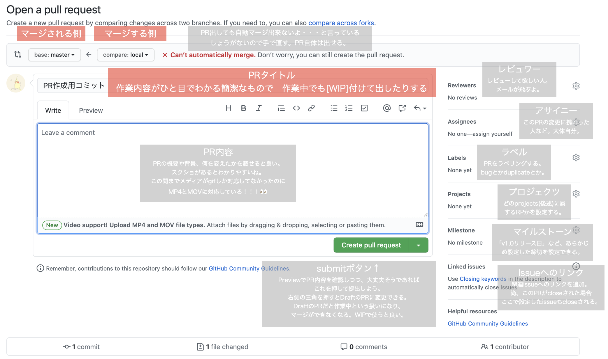

# Github（Repo Hosting Service）の概要

- Gitを利用したサービス。
- GUIによるコードの閲覧・管理はもちろん、ソースコードをダウンロードできたり、直接コメントをつけることも可能。コードメインのSNS。
- `PullRequest(PR)`という、「コードのレビューをお願いします」「あわよくばマージしてください」申請機能があるのが特徴。
- マスコットキャラクターはOctocat、タコネコという種族の「Monalisa（モナリサ）」ちゃん。

## PullRequest

「Pull（修正内容を反映）してください」の「request（お願い）」。GitLabだとmerge request。

- 複数人で開発作業をしている時、リモートリポジトリに作業内容をpushして、本筋であるmasterブランチに反映（merge）してほしい時にやるもの。
- それと同時にコードのレビュー（批評）が行われる。コメントつけてここ直して！って言われたり。
- 管理者が「オッケー！」と思ったらpull requestのmergeが行われ、指定したブランチにPRの内容が反映される。
- 状態には「open」「close」「draft」の三種類あり、最初は「open」もしくは「draft」。mergeされたり、管理者が「いやこれはよくないな」と思ったりしたらcloseされる。

## ForkしないタイプのPullRequest

リポジトリ共有式PullRequest。同じリポジトリをcloneで共有して作業し、PRを行う方式。

- 「同じリポジトリを共有する」とは、そのリポジトリのmasterブランチに、自由にpushする権利を付与するということ。
- Fork式より簡単にリポジトリを操作できる分、誤操作や独断に気をつけないといけない。

1. GitHubからリモートリポジトリをローカルにcloneする
1. 新しくブランチを切り、何かしらの作業をして、それをリモートリポジトリにコミットする
1. コミット完了後、リモートリポジトリにpushする。
1. githubに行く。pushしたブランチがある。
1. pull requestボタンを押して、いろいろ入力して、提出。

このあと、merge権限を持っている人がコードをレビューして、修正入ったらやり直し、もし良ければmasterにmergeしてくれる。

## ForkするタイプのPullRequest

Fork = リポジトリ

- 大前提として、「自分に共有されていないリポジトリは更新することができない」。
- コピーリポジトリを作って、そのリポジトリで作業すれば、自分の好き勝手にいじくることができる。失敗しても大丈夫！
- 更新して欲しい時は、コピーリポジトリからオリジナルのリポジトリにPRを出す。
- Forkしたら作者に通知行くから気をつけてね。

1. GitHubで作業したいリポジトリForkボタンを押す。自分のリポジトリ一覧にそのままコピーしたリポジトリが入ってる。
1. 丸っとコピーしてきたリモートリポジトリをローカルにcloneして、作業開始。
1. masterにそのままpushするもよし、ブランチ切って作業してmergeするもよし。自分のリポジトリなのでご自由にどうぞ。
1. 大元のリポジトリ（最初forkボタン押したリポジトリ）に反映して欲しいなと思ったら、大元のリポジトリにPRを送る。あとはリポジトリ共有式と同じ。

### Forkするしないの適材適所

- Fork方式の場合、開発者間の権限つけたり付けられたりみたいなのが不要になるので、オープンソースプロジェクト（OSS）向き。誰でもそのプロジェクトに対して安全に貢献ができるという。
- 逆に貢献するつもりがないなら、無駄に作成者に通知がいくことになるので、forkしない方が良いと言う文献もあったり。
- リポジトリ共有方式は権限さえあれば操作が簡易的なため、一般的に使われるのがこちら。デザイナーなどの非エンジニアに多く使われるらしい。そのままpushできるので楽だが、誤操作も荒らしもしない人選をする必要がある。

## 練習

- [リポジトリをフォークする - GitHub ヘルプ](https://help.github.com/ja/github/getting-started-with-github/fork-a-repo)- Forkしてみたい人はこちら
- [GitHub初心者はForkしない方のPull Requestから入門しよう | qnyp blog](https://blog.qnyp.com/2013/05/28/pull-request-for-github-beginners/) - リポジトリ共有式をおさらいしたい方はこちら

## Organization

- Githubアカウントの種類の一つ。
- 企業やオープンソースプロジェクトが多くのプロジェクトにわたって一度にコラボレーションできる共有アカウント。
- オーナーや管理者は、Organizationの持つデータとプロジェクトへのアクセス権限を管理することができる。
- 個人アカウントから作ることが出来る。そのアカウントはOrganizationのオーナーアカウントとなる。

個人アカウントとの相違点は以下。

<table>
  <tr>
    <td>特徴</td>
    <td>個人</td>
    <td>Organization</td>
  </tr>
  <tr>
    <td>リポジトリを持つ</td>
    <td>◯</td>
    <td>◯</td>
  </tr>
  <tr>
    <td>プロジェクトを持つ</td>
    <td>◯</td>
    <td>◯</td>
  </tr>
  <tr>
    <td>メンバーを追加する</td>
    <td>✕</td>
    <td>◯</td>
  </tr>
  <tr>
    <td>Teamという概念が存在する</td>
    <td>✕</td>
    <td>◯</td>
  </tr>
  <tr>
    <td>監査ログが存在する</td>
    <td>✕</td>
    <td>◯</td>
  </tr>
</table>

用語集
| 名称 | 説明 |
| --- | --- |
| メンバー | Orginazationに所属するユーザー。Orginazaionのリポジトリに対して何かしらの権限がオーナーから付与される。 |
| Team | 企業や団体内の小さいグループ。これに対してまとめて権限を付けたりできる。|
| 監査ログ | Organization配下で発生した出来事やそれを行った人、行った場所を確認できる。オーナーのみ。 |

### 参考

- [新しい Organization をゼロから作成 - GitHub Docs](https://docs.github.com/ja/free-pro-team@latest/github/setting-up-and-managing-organizations-and-teams/creating-a-new-organization-from-scratch)
- [githubのorganizationアカウントの運営について - Qiita](https://qiita.com/chari/items/ee16bf16715f4bbcbd9b)

## READMEとwiki

| 名称 | 説明 |
| --- | --- |
| README | アピールや説明、簡単な使い方など。それを使うユーザ向けといった感じ。 |
| wiki | 詳細な使い方や注意点に関するドキュメント。それを開発する人向けというイメージ。こちらは自動で目次がつくらしい、いいな。|

## Issue（イシュー）

- チケットとも言う（由来はRedmine）。項目を作ることを「チケットを切る」とか言う。
- 作業に関する問題を話し合うために使用される掲示板のような機能のことで、つまるところタスク管理表。
- issueを終了させることをcloseという。

| 名称 | 説明 |
| --- | --- |
| Milestone | 大まかな期限を設定する機能のこと。機能単位やリリースの予定日など。「いつからいつまでの間にこの問題解決しますよ」 |
| Label | bug(不具合)やquestion(質問)など、issueの分類わけをするためのもの。「これはどういうカテゴリの話ですか？」 |
| Assignee(アサイニー) | そのissueの担当者を割りふる機能のこと。そこに設定された人が、そのissueの担当者（作業者）。1つのissueにつき1人だけ。 |
| projects | カンバン機能（projects）と連動させる機能。ここに対応するカンバンを指定すると、projectの方にも対応するissue項目が追加されているという寸法。 |

- issueには番号が割り振られ、コミットメッセージやissueコメント欄などに`#1`のように#つきでissue番号をつけると、自動でissueへのリンクを貼ることができるという便利な仕様。
- 同じことをPRでもできて、そのPRがマージされたら、対応するissueの方も自動でcloseしてくれる。
- コミットメッセージに`create:README.md close #1`のように`close <issue番号>`と書いておくと、該当するissueを自動でcloseしてくれる。便利！魔法の呪文👏

## Project（カンバン機能）

- [Trello](https://trello.com/)のような、タスク進捗管理をGUIで行うツール。いわゆる「カンバン」。

- GitHubのリポジトリページの中、「Projects」というタブから新しいprojectを作成し、カンバンを作る。
- Templateタブからお好みのデフォルトカラムセットが選べるぞ！

  例・Template：「Basic」のデフォルトカラム
  - Todo(やらないといけないこと)
  - In progress(作業中)
  - Done(完了)
- ここに項目を増やしていき、作業中や完了など、進捗ごとにタスクを移動させて使う。夏休みの宿題の進捗管理これだったらな。
- [Githubでカンバン機能を利用する方法｜Koushi Kagawa 😊｜note](https://note.mu/koushikagawa/n/n5e4280fd0ee1) - 使ってみた方が早い。

- フェンリル島根支社ではホワイトボードに付箋とマグネットとテープ仕切りというアナログ手法でタスク管理をやっていた。とっても良いと思う。

## Pages

- Githubによる、静的サイトのホスティングサービス。
- Githubのアカウントさえあればすぐに静的サイトが公開できるので、非常にお手軽。
- HTML、CSSや画像などはもちろん、JavaScriptも動作する。

1. 静的サイトのソースのリポジトリの`settings`から、`github Pages` → `Source`を選ぶ
1. `master branch`を選択し、その後`Save`ボタンを押す。
これだけで、masterブランチの内容がそのままGithub Pagesとして公開される。べ、便利〜！？

1. `https://ユーザまたは組織名.github.io/リポジトリ名` で公開したページにアクセスできる。便利〜〜〜〜！！！！！！！

イラストやCSSデザイナのポートフォリオサイトとかこれで全然いけるのでは…と思いました
### 参考

- [GitHub Pages を使った静的サイトの公開方法が、とても簡単になっていた ｜ Tips Note by TAM](https://www.tam-tam.co.jp/tipsnote/html_css/post11245.html)

## gist

> gist は、データのスニペットや抜粋を他の人と共有するための簡単な方法です。
>
> Gist にはコードの文字列や bash スクリプト、その他の小さなデータの断片などがあります。これらの情報はGitHubでリポジトリとしてホストされています。
>
> gistはGitHub上で自由に作成・保存できるだけでなく、簡単に作成することができます。

- Gitのリポジトリの一種。リポジトリなのでフォークしたりクローンしたりできる。状態もパブリックとプライベートの2種。
- Githubにサインインしていれば、そのアカウントに関連付けられ、[Gist home page](https://gist.github.com/)に移動すると自分のGistリストに表示される。
- 他の人のパブリックGistを探すこともできる。一度パブリックにしたGistをプライベートにはできない。
- 大体のファイルを上げられるが、主にコードを載せたり、markdownで資料をまとめたりするのに使われる。
- 複雑な機能がなく、秒でコードやテキストを共有できるのでそういうときに良い。

### 参考

- [Gist の作成 - GitHub Docs](https://docs.github.com/ja/free-pro-team@latest/github/writing-on-github/creating-gists)

## ブランチモデル

ブランチの切り方にもモデルがあるらしい。有名なのは「Git Flow」「GitHub Flow」

### Git Flow

`master`ブランチの他に、`develop`ブランチ、`feature`ブランチ、`release`ブランチ、`hotfix`ブランチがあって、それらを使い分けるブランチの切り方。

| ブランチ名 | 説明 |
| --- | --- |
| master | master。ここで作業は行わず、完成してもうすぐデプロイできるぞ、的な内容がここに集結する。| develop | 実際に作業するメインのブランチ・・・とはいえ、ここに直接pushしていくわけではなく、さらにまたもう一段階ブランチを作って、そこからのPRを受けていきます。開発段階の内容が入るブランチ。|
| feature | 特徴ブランチ。実際に触るのはここ。ここに作業内容をpushしていって、developブランチにPR出して、レビューしてもらったりする。|
| release | リリースが近づいたらdevelopブランチから分岐して使うブランチ。READMEやパッチなど、リリースに向けての内容が追加・修正される。リリースが終わったら、このブランチからmasterブランチへマージして、「リリースしたよ！」のバージョンタグをつける。|
| hotfix | リリース後に出てきた緊急度の高いバグ修正を行うブランチ。マージの仕方はreleaseブランチと同じ。マージする時、一緒にdevelopブランチもマージしてしまいます。|

### GitHub Flow

Git Flowに比べ大変シンプル。なんと、masterブランチとtopic（広義）ブランチしかない。私が実際に見たことあるのは多分こっち。

- masterブランチ：いつもの。このブランチにマージされたものは全てリリースされる。「masterブランチのものは、何であれ、デプロイ可能である」。
- トピックブランチ：実際に作業するブランチ。説明的な名前（例：`miyazato-new-oauth2-scopes`など）を付けたブランチを作成して、レビューしてもらいたいタイミングやマージしてほしいタイミングでPRを送る。

### どっちがいいの？

> 長いインターバル(リリースの間に数週から数カ月)で定型的なリリースを行わなければならないチームや、ホットフィックスやメンテナンス・ブランチ、そしてごくまれに出荷で発生するその他の事々にとって、 git-flow は意味があり、私はその使用を強く推奨するだろう。
>
> 製品を毎日プッシュし、コンスタントにテストしデプロイするという、出荷の文化を作り上げてきたチームに対して、私はGitHub Flowのようなもっとシンプルな何かを選ぶことをお勧めする。
>
> なぜGitHubではgit-flowを使わないのだろうか？ 私たちが常にデプロイをするから、というのが主な理由ではある。 git-flowのプロセスは主として「リリース」を中心に設計されている。 私たちはプロダクション環境へのデプロイを毎日（たいていは日に何回も）行うため、「リリース」というものがない。

しょっちゅうデプロイする(のでリリースがなく、hotfixブランチの必要性がない)チームのためのGitHub Flow、ということらしい。

### 参考：[GitHub Flow (Japanese translation)](https://gist.github.com/Gab-km/3705015)

## GitHubコミュニケーション

GitHub（に限らず、SNSでのコミュニケーション）において、文字だけでは誤解を招く可能性がある。そのため、GitHubでも絵文字や略語がよく使われるらしい。

### emoticon（エモティコン）

絵文字のこと。emotionとiconを合体させた造語のような気がする（私見）。「emo○i...」っていうところが日本語の絵文字（えもじ）と一緒なのは偶然なのか何なのか。
名称を`:`で囲むことで絵文字表示が可能。

| 名称 | 書き方と意味 |
| --- | --- |
| `:smile:` | :smile: 笑顔 |
| `:innocent:` | :innocent: 天使 |
| `:+1:` | :+1: いいね！ |
| `:clap:` | :clap: 拍手 |

- [EMOJI CHEAT SHEET](http://www.emoji-cheat-sheet.com/) - 他にもいろいろあるのでご参照くださいませ。
- [Gitで絵文字コミットをするために行った3つの準備ステップ - Qiita](https://qiita.com/nishina555/items/4b4bb79dc93398d4d0a1) - コミットメッセージにつけるのもいいかも。

## 略語

WIPとかよく使う。

| 略語 | 意味 |
| --- | --- |
| LGTM | 「Looks Good To Me」の略。「良いんじゃない？👌」的ニュアンス。レビューの終了や承認を表す場合も。 |
| IMO | 「In My Option」。「私が思うに」。 |
| AFAIK | 「As Far As I Know」。「私の知る限りでは」。 |
| IMHO | IMOに「Humble(控えめ、謙虚な)」を加えた略語。「つまらない意見ですが」的なニュアンス。|
| IMHO（余談） | 同じIMHOで「In My Honest Opinion」「率直に言うと」という意味もあるらしいので文脈に注意。いやそんなわかりづらい使い方しないでほしい。 |
| NP | 「No Problem」。「気にしないで、どうたしまして」の意。 |
| Nitpick/NITS | 粗探しをする、という意味の動詞。小さなことを指摘する、という意味。粗探ししてごめんね的な姿勢が伺える気がする。|
| WIP | 「Work In Progress」。「作業中なのであんまり小さいとこツッコまないでね、そういうのはちょっと待ってね」の意。|
| MUST | 「もう明らかに間違えているので絶対に直そう」の意。しなければならない。絶対。 |
| SHOULD | 「やばい間違いではないけど、直しといた方が良い」の意。すべき。推奨。|
| ETA | 「Estimated time of arrival」。作業の完了予定時刻のこと。|
| PTAL |「Please Take Another Look」。「再度ご確認ください」の意。 |
| e.g. | For example（例えば、）の略らしい ex.じゃダメなんだろうかと思ったら、ラテン語の「exempli gratia」の方に寄せているっぽい、なるほど。 |
| cf. | 「参照」の意。ラテン語で「参照せよ」「比較せよ」を意味する命令形「confer」の略形。|

その他詳しくはこちら

- [英語のコメントや issue で頻出する略語の意味 (FYI, AFAIK, ...) - Qiita](https://qiita.com/uasi/items/86c3a09d17792ab62dfe)

## OctocatのMonalisaちゃん

GitHubといえば！？あの黒い猫耳のマスコットキャラクター。Ryan Tomaykoさんの娘さんが作ったお話が可愛い。要約するとタコ足に見えるサンゴ足のタコネコの、モナリサちゃん。
> 原文：Once upon a time, there was a cat who's name was Monalisa. Monalisa and her owner went to the beach. When Monalisa got to the beach, her owner Kelly gave her goggles so Monalisa could swim and see what was in the ocean. When Monalisa went in the water she found lots of fish. When Monalisa was swimming she was so exited she opened her mouth and swouloed a coral that made you grow legs like a octapus but keep your normal face. So Monalisa grew legs and became Mrs. Monalisa octocat.

> 訳：むかしむかし、モナリサという猫がいました。モナリサと飼い主は、ある日ビーチに行きました。ビーチに到着すると、飼い主のKellyが海の中を泳いで見られるようにと、モナリサにゴーグルを渡しました。モナリサが水の中に潜ると、たくさんの魚が見えました。モナリサはとても興奮し口を開けると、サンゴが口の中に入ってしまいました。すると、サンゴが口の中に入った瞬間、まるでタコのように足が伸びました。しかし、顔はそのままでした。だからモナリサは、足が伸びた「Mrs. Monalisa octocat」（モナリサ・タコネコ）になったのです。
（原文提供：Scott Chaconさん）

## 参考

- [GitHub のフォーク （fork） とプルリクエスト （pull request） の使い方 - akihiro kamijo](http://cuaoar.jp/2013/03/github-fork-pull-request.html)
- [GitHub初心者はForkしない方のPull Requestから入門しよう | qnyp blog](https://blog.qnyp.com/2013/05/28/pull-request-for-github-beginners/)
- [リポジトリのcloneとforkの違い - Qiita](https://qiita.com/matsubox/items/09904e4c51e6bc267990)
- [【初心者向け】「コミットの粒度がわからない問題」の模範解答を考えてみた - Qiita](https://qiita.com/jnchito/items/40e0c7d32fde352607be)
- [コミットは作業ログではない！ - Qiita](https://qiita.com/suzuki-hoge/items/cc91877ce69527ced692)
- [GitHubの基本操作や用語、便利な機能などをまとめたドキュメントです。](https://gist.github.com/manabuyasuda/f449b313970c7a51b655)
- [GitHubのキャラクターの足がタコなのは「サンゴ」を食べたからだった！　正式名称は「Octocat」ではなく「Monalisa」 - ねとらぼ](https://nlab.itmedia.co.jp/nl/articles/1506/09/news113.html)