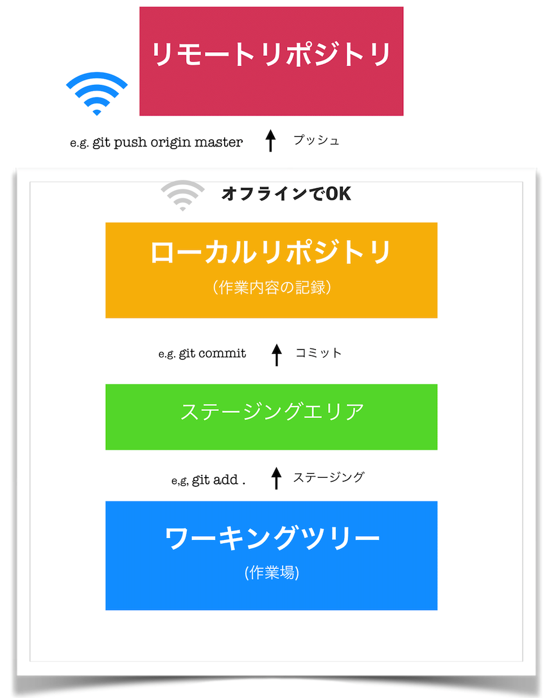

# Version Control Systems

## バージョン管理とは

編集時点ごとで変更内容を管理することを「**バージョン管理**」と呼ぶ。が、

- ファイルを編集前の状態に戻したい時。
- 大昔に消したファイルを復活させたい時。

そんな時、ファイル名やディレクトリ名で編集した日付を残し管理するのは、ものすごく大変。
（e.g.「【最終版】201204_ドキュメント.docx」「201204_ドキュメント_修正版.docx」「201204_ドキュメント_最新版.docx」「201204_ドキュメント_最新版の修正版.docx」）

また、

- 複数人で1つのファイルを編集したい時。

こういうときも、お互いが編集するタイミングによって、先に編集した人の変更内容が消えてしまうかもしれない…

と、悩みが尽きない。

### そんなあなたに、**バージョン管理システム**

先述のような場面で、バージョン管理を便利にしてくれるシステムがこれ。

- ファイルの状態を好きなときに更新履歴として保存
- 他人の編集した最新ファイルを上書きしようとした時に警告を出す

これにより、バージョン管理の困りごとを解消してくれる。

## Gitの概要

現在一番有名であろうバージョン管理システム、**Git**。

バージョン管理システムは主に２つに分かれる。

- 分散型：各個人のPCのGitというデータベースでソースコードを管理する
- 集中型：1つのリポジトリにソースコードを集めて管理する

Gitは、分散型に分類されるバージョン管理システムである。

> ネットワークにアクセスできないなどの理由でリモートリポジトリにアクセスできない環境でも、履歴の調査や変更の記録といったほとんどの作業を行うことができる。これが分散型と呼ばれる理由である。

`.git`の中にある謎の大量のオブジェクトがその正体。

## ブランチとは

作業履歴の流れを分岐して記録していくもの。枝分かれした歴史。よくパラレルワールドに例えられる。

> ソフトウェアの開発では、ひとつのソフトウェアに対して複数のメンバーが同時に機能追加を行ったり、バグ修正を行ったりといったことがあります。

> また、複数のリリースバージョンが存在する状態で、それぞれを保守しなければならないといったこともあります。

上記のような、並行作業を求められる作業を支援するための機能がブランチ。

### 特徴

- 分岐したブランチの内容は他のブランチの影響を受けないため、~~何をしても怒られない~~
 同じリポジトリで複数の変更を同時に進めることが出来る。

- 分岐したブランチは併合することができる。(👉 merge)

- 作業単位で履歴を残すことにより、問題が発生した場合に原因となる箇所の調査や対策が容易

## ローカル（リポジトリ）とリモート（リポジトリ）

### そもそもリポジトリとは

ファイルやディレクトリの状態を記録する場所。

- 例えば前述の「【最終版】201204_ドキュメント.docx」を、「ドキュメント.docx」だけで何版でも管理できるよう変更履歴を記録している。
- 変更履歴を管理したいディレクトリやファイルを、これ（リポジトリ）の管理下に置くことで、ディレクトリやファイルの変更履歴を記録してくれる。具体的には`git init`(後述)など。

### ローカルとリモート

- ローカルリポジトリ：ユーザ一人ひとりの手元のマシンに配置されているリポジトリ
- リモートリポジトリ：専用のサーバに配置される、複数人で共有するためのリポジトリ

✔ 自分一人だけの作業で、バージョン管理をしたい場合はローカルリポジトリのみで完結する。オフラインで作業可能。

✔ 複数人で共同作業したい場合や、ソースコードを公開したい場合に、リモートリポジトリにアップロードして公開する。
インターネット必須。

## Gitの基本的な使い方

1. ディレクトリをリポジトリの管理下に追加する
1. ファイルを編集する
1. 変更を記録したい箇所を、ステージングエリアに**ステージング**する
1. ステージングした編集箇所を**コミット**する

基本的に上記の繰り返し。



### init

`git init`

- リポジトリを新規作成するコマンド。
- 既存のリポジトリを初期化するのにも使える。
- `git init --bare --share`で共有リポジトリを作ることも出来る。
- 実行すると、コマンドを打ったディレクトリ直下に`.git`が作られる。これがリポジトリの実物。
- なお、`.git`の中身は以下の通り。

```
% ls -a .git
.               COMMIT_EDITMSG  HEAD            config          hooks           info            objects
..              FETCH_HEAD      ORIG_HEAD       description     index           logs            refs
```

### add

`git add`

- 変更箇所をステージングエリア（インデックス）にステージングする（上げる、とも言う）コマンド。

| 使用例 | 説明  |
| --- | --- |
| git add . | すべてのファイル・ディレクトリをステージングする。「`.`」は全部の意。|
| git add *.css | `.css`ファイル全てをステージングする。ワイルドカードも使用可能。|
| git add -n | 追加されるファイルを調べる。 |
| git add -u | 変更されたファイルを追加する |
| git rm --chached | addしてしまったファイルを除外（ステージングエリアから戻す、下げる）

`git status`でステージングエリアに上がっている変更・上がっていない変更を確認することが出来る。

### commit

`git commit`

- ステージングエリアに上げた箇所をコミットとしてリポジトリに登録する。
- 変更履歴に新しくコミットを追加するので、「コミットを積む」と言われたりもする
- 主に使われるのは `git commit -m "メッセージ"`。
  - コメントを付けることができる。ここに変更概要を書いておくと親切。メッセージの良い書き方はこちら → [Gitのコミットメッセージの書き方 - Qiita](https://qiita.com/itosho/items/9565c6ad2ffc24c09364)

| 使用例 | 説明 |
| --- | --- |
| git commit -a | 変更のあったファイルすべてをコミットする。 |
| git commit --amend | 直前のコミットメッセージを編集できる。間違えても大丈夫！ |
| git commit -v | 変更点を表示してコミット |

### push

`git push [リモート名] [ブランチ名]`

- ローカルリポジトリの内容をリモートリポジトリに送信（アップロード）するコマンド。
- 自分だけのリポジトリに上げる場合は大体`git push origin master`。
- 上記の場合だと、リモートのmasterブランチに、ローカルリポジトリのmasterブランチの内容が反映される。

| 使用例 | 説明 |
| --- | --- |
| git push origin [ブランチ名]:[リモートブランチ名] | [リモートブランチ名]に、[ブランチ名]の内容を反映させる。[リモートブランチ名]がリモートリポジトリに存在しない場合は新規作成される。ちなみに、`git push origin master`と`git push origin master:master`は同義。|
| git reflog origin/[ブランチ名] | pushのログを見ることが出来る。|
| git push origin :[リモートブランチ名] | リモートのブランチを削除することが出来る。（nullなブランチを指定したリモートブランチに反映させて消しているイメージ）|
| git push -f origin HEAD^:master | リモートリポジトリのコミットバージョンを戻す。この場合は一つ戻す。|
| git push -f origin [ハッシュ値]:master | 特定のコミットに戻す場合。コミットのハッシュ値は`git log`で見ることが出来る。|


### fetch

### merge

### pull

### clone

### checkout

### rebase

### reset

## Githubの概要

## Githubの基本的な使い方

