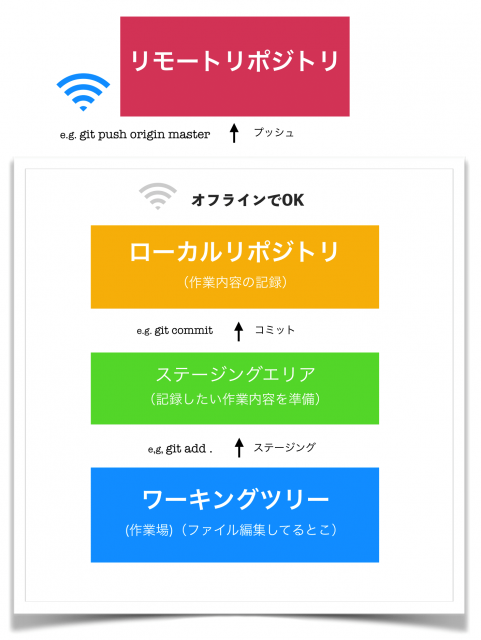

# Version Control Systems

## バージョン管理とは

編集時点ごとで変更内容を管理することを「**バージョン管理**」と呼ぶ。が、

- ファイルを編集前の状態に戻したい時。
- 大昔に消したファイルを復活させたい時。

そんな時、ファイル名やディレクトリ名で編集した日付を残し管理するのは、ものすごく大変。
（e.g.「【最終版】201204_ドキュメント.docx」「201204_ドキュメント_修正版.docx」「201204_ドキュメント_最新版.docx」「201204_ドキュメント_最新版の修正版.docx」）

また、

- 複数人で1つのファイルを編集したい時。

こういうときも、お互いが編集するタイミングによって、先に編集した人の変更内容が消えてしまうかもしれない…

と、悩みが尽きない。

### そんなあなたに、**バージョン管理システム**

先述のような場面で、バージョン管理を便利にしてくれるシステムがこれ。

- ファイルの状態を好きなときに更新履歴として保存
- 他人の編集した最新ファイルを上書きしようとした時に警告を出す

これにより、バージョン管理の困りごとを解消してくれる。

## Gitの概要

現在一番有名であろうバージョン管理システム、**Git**。

バージョン管理システムは主に２つに分かれる。

- 分散型：各個人のPCのGitというデータベースでソースコードを管理する
- 集中型：1つのリポジトリにソースコードを集めて管理する

Gitは、分散型に分類されるバージョン管理システムである。

> ネットワークにアクセスできないなどの理由でリモートリポジトリにアクセスできない環境でも、履歴の調査や変更の記録といったほとんどの作業を行うことができる。これが分散型と呼ばれる理由である。

`.git`の中にある謎の大量のオブジェクトがその正体。

## ブランチとは

作業履歴の流れを分岐して記録していくもの。枝分かれした歴史。よくパラレルワールドに例えられる。

> ソフトウェアの開発では、ひとつのソフトウェアに対して複数のメンバーが同時に機能追加を行ったり、バグ修正を行ったりといったことがあります。

> また、複数のリリースバージョンが存在する状態で、それぞれを保守しなければならないといったこともあります。

上記のような、並行作業を求められる作業を支援するための機能がブランチ。

### 特徴

- 分岐したブランチの内容は他のブランチの影響を受けないため、~~何をしても怒られない~~
 同じリポジトリで複数の変更を同時に進めることが出来る。

- 分岐したブランチは併合することができる。(👉 merge)

- 作業単位で履歴を残すことにより、問題が発生した場合に原因となる箇所の調査や対策が容易

## ローカル（リポジトリ）とリモート（リポジトリ）

### そもそもリポジトリとは

ファイルやディレクトリの状態を記録する場所。

- 例えば前述の「【最終版】201204_ドキュメント.docx」を、「ドキュメント.docx」だけで何版でも管理できるよう変更履歴を記録している。
- 変更履歴を管理したいディレクトリやファイルを、これ（リポジトリ）の管理下に置くことで、ディレクトリやファイルの変更履歴を記録してくれる。具体的には`git init`(後述)など。

### ローカルとリモート

- ローカルリポジトリ：ユーザ一人ひとりの手元のマシンに配置されているリポジトリ
- リモートリポジトリ：専用のサーバに配置される、複数人で共有するためのリポジトリ

✔ 自分一人だけの作業で、バージョン管理をしたい場合はローカルリポジトリのみで完結する。オフラインで作業可能。

✔ 複数人で共同作業したい場合や、ソースコードを公開したい場合に、リモートリポジトリにアップロードして公開する。
インターネット必須。

## Gitの基本的な使い方

1. ディレクトリをリポジトリの管理下に追加する
1. ファイルを編集する
1. 変更を記録したい箇所を、ステージングエリアに**ステージング**する
1. ステージングした編集箇所を**コミット**する

基本的に上記の繰り返し。



### init

`git init`

- リポジトリを新規作成するコマンド。
- 既存のリポジトリを初期化するのにも使える。もしそのリポジトリが`clone`したものだったなら、初期化する以外の目的で使わないこと。
- `git init --bare --share`で共有リポジトリを作ることも出来る。
- 実行すると、コマンドを打ったディレクトリ直下に`.git`が作られる。これがリポジトリの実物。
- なお、`.git`の中身は以下の通り。

```zsh
% ls -a .git
.               COMMIT_EDITMSG  HEAD            config          hooks           info            objects
..              FETCH_HEAD      ORIG_HEAD       description     index           logs            refs
```

### add

`git add`

- 変更箇所をステージングエリア（インデックス）にステージングするコマンド。
- ステージングすることを「上げる」とも言う。e.g.「修正したところaddして上げとこう」

| 使用例/オプション | 説明  |
| --- | --- |
| `git add .` | すべてのファイル・ディレクトリをステージングする。「`.`」は「全部」の意。|
| `git add *.css` | `.css`ファイル全てをステージングする。ワイルドカードも使用可能。|
| `-n` | addできるファイルを調べる。 |
| `-u` | 変更されたファイルを追加する。 |
| `git rm --chached` | addしてしまったファイルを除外（ステージングエリアから戻す、下げる）

`git status`でステージングエリアに上がっている変更・上がっていない変更を確認することが出来る。

### commit

`git commit`

- ステージングエリアに上げた箇所をコミットとしてリポジトリに登録する。
- 過去のコミットが積み重なっているところにコミットを追加するので、「コミットを積む」と言われたりもする。
- 主に使われるのは `git commit -m "メッセージ"`。コミットメッセージを書くことが出来る。
  - ここに変更概要を書いておくと親切。メッセージのお手本、書き方の一例はこちら → [Gitのコミットメッセージの書き方 - Qiita](https://qiita.com/itosho/items/9565c6ad2ffc24c09364)

| オプション | 説明 |
| --- | --- |
| `-a` | 変更のあったファイルすべてをコミットする。 |
| `--amend` | 直前のコミットメッセージを編集できる。間違えても大丈夫！ |
| `-v` | 変更点を表示してコミット |

### push

`git push [リモート名] [ブランチ名]`

- ローカルリポジトリの内容をリモートリポジトリに送信（アップロード）するコマンド。
- 自分だけのリポジトリに上げる場合は大体`git push origin master`。
- 上記の場合だと、リモートのmasterブランチに、ローカルリポジトリのmasterブランチの内容が反映される。

| オプション/使用例 | 説明 |
| --- | --- |
| `git push origin [ブランチ名]:[リモートブランチ名]` | [リモートブランチ名]に、[ブランチ名]の内容を反映させる。[リモートブランチ名]がリモートリポジトリに存在しない場合は新規作成される。ちなみに、`git push origin master`と`git push origin master:master`は同義。|
| `git reflog origin/[ブランチ名]` | pushのログを見ることが出来る。|
| `git push origin :[リモートブランチ名]` | リモートのブランチを削除することが出来る（空のブランチで指定したリモートブランチを上書きして消しているイメージ）。|
| `--delete [リモートブランチ名]` | 上記と同義。 |
|`-f(または--force)`| プッシュを強制する。ローカルとリモートでの履歴のコンフリクトが発生する場合でも、強制的にリモートを上書き出来る。複数人で開発している場合は、使用に注意が必要。 |
| `git push -f origin HEAD^:master` | リモートリポジトリのコミットバージョンを戻す。この場合は一つ戻す。|
| `git push -f origin [ハッシュ値]:master` | 特定のコミットに戻す。コミットのハッシュ値は`git log`で見ることが出来る。|
| `--force-with-lease` | ローカルの履歴がリモートよりも新しいときだけ強制プッシュする。|
| `-u(--set-upstream) origin master` | 上流ブランチを設定し、その後はブランチ名を省略出来るようになる。この場合だと、ローカルのmasterブランチの上流ブランチとしてリモートのmasterブランチが設定される。|
| `--all` | 全てのブランチをpushする。ブランチ名を指定することは出来ない。configのpush.defaultの設定値があれば、それに応じて振る舞いが変わる。 |
| `--tags` | 全てのタグをpushする。 |

#### タグって何？

- コミットにわかりやすい名前をつけるための目印。
- これによって履歴内の特定のコミットが参照しやすくなる。
- `git tag <tag-name>`もしくは`git tag -a <tag-name> -m "message"`で先頭のコミットにタグを付けられる。
- `git tag`でタグ一覧表示、`git tag -l "v1.0"`で特定のタグのみ表示。

### fetch

`git fetch origin master`

- リモートリポジトリの最新情報をローカルリポジトリに持ってくるコマンド。
- 具体的に言うと、もし`master`ブランチをfetchしてきたとしたら、`origin/master`ブランチが更新されることになる。
- 下の図で言うところのローカルリポジトリ（origin/masterブランチ）にのみ反映され、それより下のワーキングツリー(masterブランチ)・ステージングエリアには影響しないので、実物のファイルが変更されるわけではない。


- 中身を見たい場合は後述の`checkout`を使う。

| オプション名/使用例 | 説明 |
| --- | --- |
| `git fetch origin` | `origin`のリモートの全てのブランチの情報を取得する。なお、何も指定されていない場合はorigin |
| `--all` | originに限らず、全てのリモートの全てのブランチの情報を取得する。 |
| `--prune` | リモートで削除されたブランチを、ローカルのリモートブランチ（remotes/origin/〇〇 等）から削除する |

### merge

`git merge origin/master`

- ブランチとブランチを併合(merge)するコマンド。
- 今いるブランチが`master`だとすると、上記の例では`origin/master`をローカルの`master`ブランチにマージする。
- ここまですることで、ようやくリモートブランチの最新の内容が手元の作業環境まで反映される。
- 競合（コンフリクト）を起こす場合がある。その場合、「<<<」「===」「>>>」の記号を使って、競合箇所が示される。

| オプション名 | 説明 |
| --- | --- |
| `git merge --abort` | コンフリクトが起きて、コミットが行われていない状態の時に使える。マージを中断して`git merge`実行前の状態に戻す。 |
| `git merge --continue` | コンフリクトを解消した時に、マージを完了するよう指示するコマンド。マージを再開する。|
| `-ours` `-theirs` | コンフリクトが起きた時のマージ方針を指定するコマンド。`-ours`は今いるブランチの変更を、`-theirs`ではマージするブランチの変更を優先して、強制的にマージを行う。 |

### pull

`git pull origin master`

- 先程の`fetch` → `merge`を一括でやってくれるコマンド。
- マージまで一気にやってしまうので、コンフリクト（競合）に注意。やってしまった場合は地道に手で直そうね。
- ブランチ名だけでなく、`git pull origin [タグ名]`でタグ名で指定してpullしてくることも出来る。

| オプション | 説明 |
| --- | --- |
| `--no-commit` | マージのコンフリクトがない場合でも、マージの失敗を装うコマンド。マージコミットを作る前に、ファイルの内容を確認したり、修正したりする機会を与えてくれる。 |
| `--no-ff` | マージの結果がfast-forwardだとしても、コミットを作るコマンド。 |
| `--squash` | マージするブランチのコミットをまとめたコミットを作成し、それをマージされるブランチの先頭に追加する。 |
| `--rebase` | マージの代わりにrebase（後述）をする。`fetch` + `rebase`になる。 |

#### fast-forwardマージとは？

ブランチAと、そこから切ったブランチBがあるとする。
分岐後に、元ブランチAにおいて変更がない時に行われるマージのこと。

```zsh
A--B--C  (A)
       \
        D--E  (B)
```

このような時に、`git merge B`をすると、Aの先頭がブランチBの先頭に移動する。=合流が行われない。

これがfast-forward。

### clone

`git clone [リポジトリURL]`

- リモートリポジトリを複製する。
- カレントディレクトリにリポジトリと同名のディレクトリを作成し、そこにリポジトリの中身を複製する。
- リポジトリ名とは別のディレクトリ名にしたい場合は`git clone [リポジトリ名] [ディレクトリ名]`で。
- 非公開リポジトリの場合、ユーザー名とパスワードの入力が必要。（URLをhttpsで指定した場合）

### checkout

`git checkout master`

- ワークツリー（作業場）の内容を、指定したブランチに切り替える。
- 上記コマンドの場合、ワークツリーの内容をmasterブランチに切り替える。

| 使用例 | 説明 |
| --- | --- |
| `git checkout -b [ブランチ名]` | 新しいブランチを作りつつ、そのブランチに移動する。 |
| `git checkout [タグ名]` | ワークツリーのの内容を、そのタグを付けた時の状態に戻す。 |
| `git checkout [ハッシュ値]` | ワークツリーの内容を、ハッシュ値で指定したコミット時点の状態に戻す。 |

### rebase

`git rebase master`

- ブランチが生えてきた元をすげ替えるコマンド。

これを

```zsh
      A---B---C topic
     /
D---E---F---G master
```

`git rebase master topic`すると

こう

```zsh
              A'---B'---C' topic
             /
D---E---F---G master
```

- コミットを一つずつ付け替えていくので、コンフリクトが発生する場合もある。
- その場合は、`merge`の時同様、`--abort（止める）`かコンフリクトを直して`--continue（続ける）`かの操作を行う。

- `git rebase -i 派生元コミット`でコミットを一つにまとめることができる。
- 普通にまとめるために使ってもいいし、これをやってから`rebase`すると、コンフリクトが1回で済む。

### reset

`git reset [何を戻す] [どこまで戻す]`

- うっかり間違えてしまったcommitやaddを無かったことにするコマンド。
-[どこまで戻す]かは`HEAD`、`HEAD^`、コミットのハッシュなどで指定する。
  - `HEAD`は最新のコミット。`HEAD^`は最新から数えて一つ前のコミット。
- 修正の及ぶ範囲（何を戻すか）は、オプションで決まる。

| オプション | 説明 |
| --- | --- |
| `--soft` | `HEAD`の位置のみ |
| `--mixed（デフォルト）` | `HEAD`の位置・インデックス |
| `--hard` | `HEAD`の位置・インデックス・ワーキングツリー全て |

要するに、

- 間違えたコミット"だけ"をなかったことにしたい　→　`--soft`
- 間違えたコミットもaddしたやつもなかったことにしたい → `--mixed`又はオプションなし
- コミットもaddもファイルの変更自体もなかったことにしたい → `--hard`

## 参考

- [[git reset (--hard/--soft)]ワーキングツリー、インデックス、HEADを使いこなす方法 - Qiita](https://qiita.com/shuntaro_tamura/items/db1aef9cf9d78db50ffe)
- [git-resetは結局何を戻すのか - Qiita](https://qiita.com/fnobi/items/ec036c1b5d7ee5a8517c)

## Github（Repo Hosting Service）の概要

- Gitを利用したサービス。
- GUIによるコードの閲覧・管理はもちろん、ソースコードをダウンロードできたり、直接コメントをつけることも可能。コードメインのSNS。
- `PullRequest(PR)`という、「コードのレビューをお願いします」「あわよくばマージしてください」の申請機能があるのが特徴。
- マスコットキャラクターはOctocat、タコネコという種族の「Monalisa（モナリサ）」ちゃん。


## PullRequest

「Pull（修正内容を反映）してください」の「request（お願い）」。GitLabだとmerge request。

- 複数人で開発作業をしている時、リモートリポジトリに作業内容をpushして、本筋であるmasterブランチに反映（merge）してほしい時にやるもの。
- それと同時にコードのレビュー（批評）が行われる。コメントつけてここ直して！って言われたり。
- 管理者が「オッケー！」と思ったらpull requestのmergeが行われ、masterブランチにPRの内容が反映される。
- 状態にはopenとcloseの二種類あり、管理者が「いやこれはよくないな」と思ったらcloseされる。

### ForkするタイプのPullRequest

Fork = コピー（リモート）リポジトリ

- 共有されていないリポジトリは、更新することができない。
- ↑そのコピーリポジトリを作って、そのリポジトリで作業すれば、自分の好き勝手にいじくることができます。失敗しても問題ない。
- そのため、 オリジナルリポジトリをFork（コピー作成）→ローカルリポジトリにclone（手元に落とす）→作業　という流れ。
- 更新して欲しい時は、Forkしたリポジトリから、オリジナルのリポジトリにPRを出します。「pull（して更新内容を反映してください）request」。

## ForkしないタイプのPullRequestって何

＝リポジトリ共有式PullRequest。Fork（コピーリモートリポジトリ）を作らず、同じリポジトリをcloneで共有して作業し、PRを行う方式。

- 同じリポジトリを共有するとは？→そのリポジトリのmasterブランチに、好き勝手にpushする権利があるということ。やろうと思えばいつでもリポジトリ汚せる。
- Fork式より簡単にリポジトリを操作できる分、誤操作や独断に気をつけないといけない。

### なるほどつまり・・・

- コピ−をリモートリポジトリに作る（Fork式）か、ローカルリポジトリに作る（リポジトリ共有式）かの違い。
- リポジトリ作成者に通知がいく（Fork式）か、いかない（リポジトリ共有式）かも違う。
- おそらく、身内やプロジェクト内など、作業者の信頼度わかっている時などのpushする権利を与えても良いような時には、リポジトリ共有式。
- OSSなど、他人のコードを改修する時などにはFork式が使われるのではないだろうか。多分。権限の違い。

### Forkするしないの適材適所

- Fork方式の場合、開発者間のコーディネートが不要になるので、オープンソースプロジェクト（OSS）向き。誰でもそのプロジェクトに対して安全に貢献ができるという。逆に貢献するつもりがないなら、無駄に作成者に通知がいくことになるので、forkしない方が良いと言う文献もあったり。
- リポジトリ共有方式は、デザイナーなどの非エンジニアに多いらしい。そもそも一般的にこちらの方が多いらしい。そのままpushできるので楽ですが、誤操作も荒らしもしない人選をする必要がある。
- インターンで使うのもリポジトリ共有方式じゃないだろうか。私もリポジトリ共有方式しか使ったことない。サルでもわかるGitも多分そう。確かRuby合宿もリポジトリ共有方式だった・・・

## まずはリポジトリ共有方式のPull Request

最初はGitHubからリモートリポジトリをローカルにcloneするところから始まる。そこで何かしらの作業をして、それをリモートリポジトリにコミットするところからスタート。

1. コミット完了後、リモートリポジトリにpushする。
2. githubに行く。pushしたコミットがある。
3. pull requestボタンを押して、いろいろ入力して、提出。
4. ここまででPRは完了。このあと、merge権限を持っている人がコードをレビューして、修正入ったらやり直し、もし良ければmasterにmergeしてくれる。

## Forkする方式のPull Request

まずGitHubで作業したいリポジトリForkボタンを押すところから始まる。そうすると自分のリポジトリ一覧にそのまま丸っとforkボタンを押したリポジトリが入ってる。

1. 丸っとコピーしてきたリモートリポジトリをローカルにcloneして、作業開始。
2. masterにそのままpushするもよし、ブランチ切って作業してmergeするもよし。自分のリポジトリなのでご自由にどうぞ。
3. 大元のリポジトリ（最初forkボタン押したリポジトリ）に反映して欲しいなと思ったら、大元のリポジトリにPRを送る。あとはリポジトリ共有式と同じ。

## 練習

- Forkしてみたい人はこちら→[リポジトリをフォークする - GitHub ヘルプ](https://help.github.com/ja/github/getting-started-with-github/fork-a-repo)
- リポジトリ共有式をおさらいしたい方はこちら→[GitHub初心者はForkしない方のPull Requestから入門しよう | qnyp blog](https://blog.qnyp.com/2013/05/28/pull-request-for-github-beginners/)

### commitの粒度とメッセージ

コミットはできるだけ細かい方が良い。2つの修正を1つのコミットであげてしまう、みたいなのはあまりやらない方が良い。

- 機能単位（１タスク、１チケット）で１コミットする。
- 何かあった時に、ここまで戻りたいな〜と思ったところでコミットするといい。または、正常に動く単位でコミット。
- amendやらrebaseやらであとからまとめてしまう分にはいくらでもできるので、こまめにcommitした方がハッピーになれるのかもしれない。
- コミットメッセージは3行が推奨されている。私は1行で書いている人々しか見たことがない。`add:◯◯クラスを実装`みたいに、`接頭辞（編集内容カテゴリ）：内容` みたいな書き方をよく見るし、わかりやすい。
  - コミットメッセージについて、詳しくはこちら： - [Gitのコミットメッセージの書き方 - Qiita](https://qiita.com/itosho/items/9565c6ad2ffc24c09364)

## READMEとwikiの違い

- README:リポジトリで作成しているもののアピールや説明、簡単な使い方など。それを使うユーザ向けといった感じ。
- wiki:リポジトリで作成しているものの詳細な使い方や注意点に関するドキュメント。それを開発する人向けというイメージ。こっちには自動で目次がつくらしい、いいな。

## Issue（イシュー）

チケットとも言う（多分由来はRedmine）。これの項目を作ることを「チケットを切る」とか言う。
作業に関する問題を話し合うために使用される掲示板のような機能のことで、issueを終了させることをcloseという。つまるところタスク管理表。

- Milestone(マイルストーン):大まかな期限を設定する機能のこと。機能単位やリリースの予定日など。いつからいつまでの間にこの問題解決しますよ、的な。
- Label(ラベル)：bug(不具合)やquestion(質問)など、issueの分類わけをするためのもの。これはどういうカテゴリの話ですか、という。
- Assignee(アサイニー)：そのissueの担当者を割りふる機能のこと。そこに設定された人が、そのissueの担当者（作業者）。1つのissueにつき1人だけ。
- projects:カンバン機能（projects）と連動させる機能。ここに対応するカンバンを指定すると、projectの方にも対応するissue項目が追加されているという寸法。

- issueには番号が割り振られ、コミットメッセージやissueコメント欄などに`#1`のように#つきでissue番号をつけると、自動でissueへのリンクを貼ることができるという便利な仕様。
  - 同じことをPRでもできて、そのPRがマージされたら、対応するissueの方も自動でcloseしてくれる。
  - コミットメッセージに"create:README.md close #1"のように`close <issue番号>`と書いておくと、該当するissueを自動でcloseしてくれる。便利！魔法の呪文みたい👏

## Project（カンバン機能）

（[Trello](https://trello.com/)だ・・・）タスク進捗管理をGUIでできるツール。俗に言う「カンバン」。ちなみにフェンリル島根支社ではホワイトボードに付箋とマグネットとテープ仕切りというアナログ手法でやっている。とっても良いと思う。

- GitHubのリポジトリページの中、「Projects」というタブのこと。
- そこから新しいprojectを作成し、カンバンを作る。Templateタブからお好みのデフォルトカラムセットが選べるぞ！
- 以下、一例。Template：「Basic」のデフォルトカラム。
  - Todo(やらないといけないこと)
  - In progress(作業中)
  - Done(完了)
- そこに項目を増やしていき、作業中や完了など、進捗ごとにカラムを動かして使う。夏休みの宿題の進捗管理これだったら絶対上手くやってたと思う。
- 使ってみた方が早い→[Githubでカンバン機能を利用する方法｜Koushi Kagawa 😊｜note](https://note.mu/koushikagawa/n/n5e4280fd0ee1)

## ブランチモデル

ブランチの切り方にもモデルがあるらしい。有名なのは「Git Flow」「GitHub Flow」

### Git Flow

masterブランチの他に、developブランチ、featureブランチ、releaseブランチ、hotfixブランチがあって、それらを使い分けるブランチの切り方。運用方法ややこしい。

- masterブランチ：言わずと知れたmaster。ここで作業は行わず、完成してもうすぐデプロイできるぞ、的な内容がここに集結する。
- developブランチ：実際に作業するメインのブランチ・・・とはいえ、ここに直接pushしていくわけではなく、さらにまたもう一段階ブランチを作って、そこからのPRを受けていきます。開発段階の内容が入るブランチ。
- featureブランチ：特徴ブランチ。実際にいじるのはここ。ここに作業内容をpushしていって、developブランチにPR出して、レビューしてもらったりする。
- releaseブランチ：リリースが近づいたらdevelopブランチから分岐して使うブランチ。READMEやパッチなど、リリースに向けての内容が追加・修正される。リリースが終わったら、このブランチからmasterブランチへマージして、「リリースしたよ！」のバージョンタグをつける。なんとmasterが出てくるのはほぼこれだけ。
- hotfixブランチ：リリース後に出てきた緊急度の高いバグ修正を行うブランチ。マージの仕方はreleaseブランチと同じ。このとき、一緒にdevelopブランチもマージしてしまいます。

### GitHub Flow

Git Flowに比べ大変シンプル。なんと、masterブランチとトピックブランチしかない。私が実際に見たことあるのは多分こっち。

- masterブランチ：いつもの。このブランチにマージされたものは全てリリースされる。「masterブランチのものは、何であれ、デプロイ可能である」。
- トピックブランチ：実際に作業するブランチ。説明的な名前（例：`miyazato-new-oauth2-scopes`など）を付けたブランチを作成して、レビューしてもらいたいタイミングやマージしてほしいタイミングでPRを送る。

### どっちがいいの？

> 長いインターバル(リリースの間に数週から数カ月)で定型的なリリースを行わなければならないチームや、ホットフィックスやメンテナンス・ブランチ、そしてごくまれに出荷で発生するその他の事々にとって、 git-flow は意味があり、私はその使用を強く推奨するだろう。
>
> 製品を毎日プッシュし、コンスタントにテストしデプロイするという、出荷の文化を作り上げてきたチームに対して、私はGitHub Flowのようなもっとシンプルな何かを選ぶことをお勧めする。
>
> なぜGitHubではgit-flowを使わないのだろうか？ 私たちが常にデプロイをするから、というのが主な理由ではある。 git-flowのプロセスは主として「リリース」を中心に設計されている。 私たちはプロダクション環境へのデプロイを毎日（たいていは日に何回も）行うため、「リリース」というものがない。

しょっちゅうデプロイする(のでリリースがなく、hotfixブランチの必要性がない)チームのためのGitHub Flow、ということらしい。

### 参考：[GitHub Flow (Japanese translation)](https://gist.github.com/Gab-km/3705015)

## GitHubコミュニケーション
GitHub（に限らず、SNSでのコミュニケーション）において、文字だけでは誤解を招く可能性がある。そのため、GitHubでも絵文字や略語がよく使われるらしい。
### emoticon（エモティコン）
絵文字のこと。emotionとiconを合体させた造語のような気がする（私見）。「エモ◯◯」っていうところが日本語の絵文字（えもじ）と一緒なのは偶然なのか何なのか。
名称を`:`で囲むことで絵文字表示が可能。
- `:smile:` ... :smile: 笑顔
- `:innocent:` ... :innocent: 天使
- `:+1:` ... :+1: いいね！
- `:clap:` ... :clap: 拍手

- 他にもいろいろ。[EMOJI CHEAT SHEET](http://www.emoji-cheat-sheet.com/)をご参照くださいませ。
- コミットメッセージにつけるのもいいかも・・・一例。[Gitで絵文字コミットをするために行った3つの準備ステップ - Qiita](https://qiita.com/nishina555/items/4b4bb79dc93398d4d0a1)

### 略語

WIPとかよく使う。

- LGTM：「Looks Good To Me」の略。良いんじゃない？👌的ニュアンス。レビューの終了や承認を表す場合も。
- IMO：「In My Option」。「私が思うに」。
- AFAIK：「As Far As I Know」。「私の知る限りでは」。
- IMHO：IMOに「Humble(控えめ、謙虚な)」を加えた略語。「つまらない意見ですが」的なニュアンス。
  - 同じIMHOで「In My Honest Opinion」「率直に言うと」という意味もあるらしいので文脈に注意。いやそんなわかりづらい使い方しないでほしい。
- NP：「No Problem」。「気にしないで、どうたしまして」の意。
- Nitpick/NITS：粗探しをする、という意味の動詞。小さなことを指摘する、という意味。粗探ししてごめんね的な姿勢が伺える気がする。
- WIP： 「Work In Progress」。「作業中なのであんまり小さいとこツッコまないでね、そういうのはちょっと待ってね」の意。
- MUST：「もう明らかに間違えているので絶対に直そう」の意。しなければならない。絶対。
- SHOULD：「やばい間違いではないけど、直しといた方が良い」の意。すべき。推奨。
- ETA：「Estimated time of arrival」。作業の完了予定時刻のこと。
- PTAL：「Please Take Another Look」。「再度ご確認ください」の意。
- e.g.：For example（例えば、）の略らしい・・・ex.じゃダメなんだろうか・・・と思ったら、ラテン語の「exempli gratia」の方に寄せているっぽい、なるほど。
- cf.：「参照」の意。ラテン語で「参照せよ」「比較せよ」を意味する命令形「confer」の略形。

- その他詳しくはこちら・・・[英語のコメントや issue で頻出する略語の意味 (FYI, AFAIK, ...) - Qiita](https://qiita.com/uasi/items/86c3a09d17792ab62dfe)

## OctocatのMonalisaちゃん
GitHubといえば！？あの黒い猫耳のマスコットキャラクター。Ryan Tomaykoさんの娘さんが作ったお話が可愛くて有名でわたしはとてもすき。要約するとタコ足に見えるサンゴ足のタコネコ。
> 原文：Once upon a time, there was a cat who's name was Monalisa. Monalisa and her owner went to the beach. When Monalisa got to the beach, her owner Kelly gave her goggles so Monalisa could swim and see what was in the ocean. When Monalisa went in the water she found lots of fish. When Monalisa was swimming she was so exited she opened her mouth and swouloed a coral that made you grow legs like a octapus but keep your normal face. So Monalisa grew legs and became Mrs. Monalisa octocat.

> 訳：むかしむかし、モナリサという猫がいました。モナリサと飼い主は、ある日ビーチに行きました。ビーチに到着すると、飼い主のKellyが海の中を泳いで見られるようにと、モナリサにゴーグルを渡しました。モナリサが水の中に潜ると、たくさんの魚が見えました。モナリサはとても興奮し口を開けると、サンゴが口の中に入ってしまいました。すると、サンゴが口の中に入った瞬間、まるでタコのように足が伸びました。しかし、顔はそのままでした。だからモナリサは、足が伸びた「Mrs. Monalisa octocat」（モナリサ・タコネコ）になったのです。
（原文提供：Scott Chaconさん）


# 参考
- [GitHub のフォーク （fork） とプルリクエスト （pull request） の使い方 - akihiro kamijo](http://cuaoar.jp/2013/03/github-fork-pull-request.html)
- [GitHub初心者はForkしない方のPull Requestから入門しよう | qnyp blog](https://blog.qnyp.com/2013/05/28/pull-request-for-github-beginners/)
- [リポジトリのcloneとforkの違い - Qiita](https://qiita.com/matsubox/items/09904e4c51e6bc267990)
- [【初心者向け】「コミットの粒度がわからない問題」の模範解答を考えてみた - Qiita](https://qiita.com/jnchito/items/40e0c7d32fde352607be)
- [コミットは作業ログではない！ - Qiita](https://qiita.com/suzuki-hoge/items/cc91877ce69527ced692)
- [GitHubの基本操作や用語、便利な機能などをまとめたドキュメントです。](https://gist.github.com/manabuyasuda/f449b313970c7a51b655)
- [GitHubのキャラクターの足がタコなのは「サンゴ」を食べたからだった！　正式名称は「Octocat」ではなく「Monalisa」 - ねとらぼ](https://nlab.itmedia.co.jp/nl/articles/1506/09/news113.html)