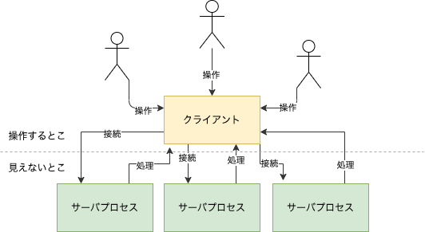
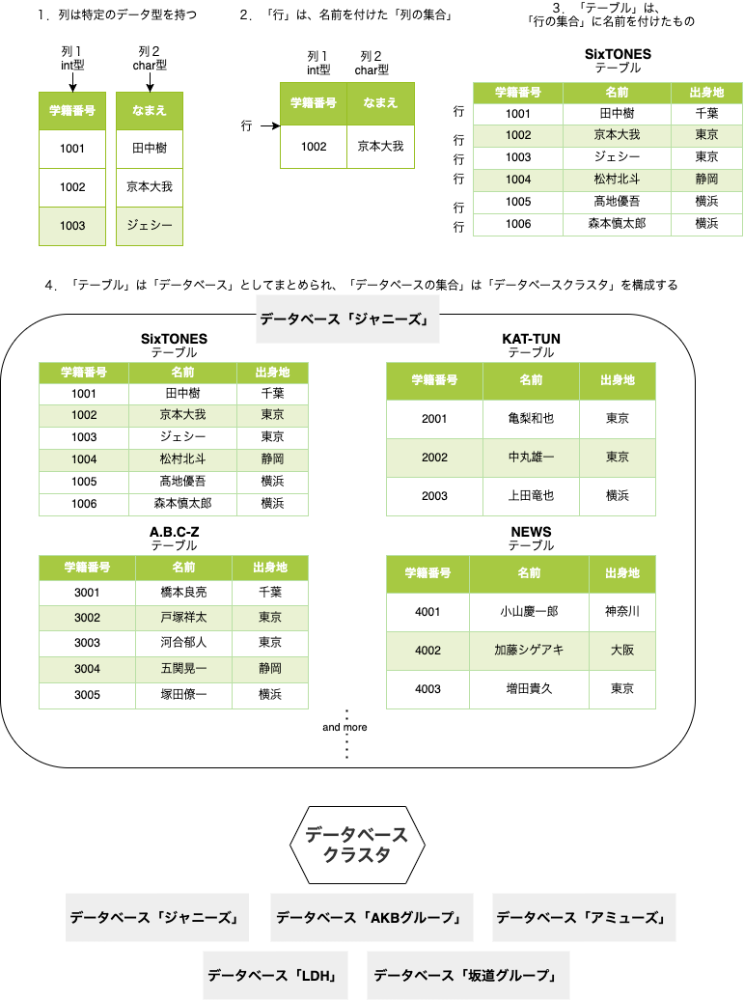

# CRUDの一連の流れを実行する

PostgreSQLの公式ドキュメント：<https://www.postgresql.org/docs/12/tutorial.html>

- PostgreSQL：多機能。
- MySQL：早く作りたい時に

## 1. Getting Started

## 1.1(インストール)

- ソースコード
- インストーラ
- homebrew
- zip

など方法は色々あるらしいですが、今回はhomebrewでインストールします。楽なので。

1. `brew install postgresql`を実行
1. `brew services start postgresql`でPCログイン時に自動起動するようにする。OFFにしたい場合は`start`→`stop`で。
1. `psql -U${USER} postgres`でログイン。`-U${USER}`は環境変数で、インストール時のmacOSログインユーザ名になっている。
1. 👆をそのまま使うのは良くないので、`postgres=# create user postgres with SUPERUSER;`で操作用のユーザ「postgres」を作成。
1. `psql -Upostgres` ログインできるかどうかを確認
1. `\l`でデータベースのリストが取得できたらOK!

## 1.2(構造的な基本事項)

- PostgreSQL（ぽすとぐれすきゅーえる）は、クライアント/サーバモデルを使用している
- セッションは以下の協調動作するプロセスから構成される。
  - サーバプロセス：DBファイルの管理、クライアントアプリケーションからの接続を受け、処理を行う。
  - クライアント：データベース操作を行うフロントアプリケーション。テキスト指向、グラフィカルなもの、色々ある。
- PostgreSQLサーバは、クライアントから複数の同時接続を取り扱うことができる。
- このため、サーバは接続ごとに新しいプロセスを開始（fork）する。
- その時点から、クライアントと新しいサーバプロセスは、元のサーバプロセスによる干渉が無い状態で通信を行える。

　まとめると大体こんな感じ



## 1.3(データベースの作成)

`% createdb mydb`

- 何も出なければOK。この場合だと「mydb」という名前のDBが作成される。
- ユーザ名と同じ名前のDBを作りたい場合は、`createdb`のみでOK。デフォルト値がユーザ名になっているため。
- DB名は、先頭をアルファベット文字から初め、長さは63バイトまでとすること。
- 削除する場合は、`dropdb [DB名]`。物理的に削除するので、取り消せないことに注意。

- トラブルシューティングは[こちら](https://www.postgresql.jp/document/9.2/html/tutorial-createdb.html)

## 1.4(データベースへのアクセス)

`% psql mydb`

```zsh
psql (13.1)
Type "help" for help.

mydb=#
```

- これにより、`mydb`データベースをアクティブにすることが出来る。
- `psql`はPostgreSQL対話式端末プログラム。irb的な。対話式にSQLコマンドの入力、編集、実行を行うことが出来る。
- `mydb=#`が「`#`」になっているのはスーパーユーザだから。それ以外の場合は`mydb=>`となっている。
- `mydb=#`はプロンプト行で、SQL問い合わせを入力できる。例えばこんな感じ。

```zsh
mydb=# SELECT version();
                                                      version
-------------------------------------------------------------------------------------------------------------------
 PostgreSQL 13.1 on x86_64-apple-darwin19.6.0, compiled by Apple clang version 12.0.0 (clang-1200.0.32.27), 64-bit
(1 row)

mydb=# SELECT current_date;
 current_date
--------------
 2021-01-27
(1 row)

mydb=# SELECT 2+2;
 ?column?
----------
        4
(1 row)
```

- psqlは、SQLコマンドではない内部コマンドを持っていて、それらは`\(バックスラッシュ)`から始まる。
- 例えば、`\h`でヘルプ、`\q`で終了。

## 2. The SQL Language

## 2.1(序文)

ユーザ定義の関数と型をコンパイルして、読み込ませる作業。一旦使わなさそうなのでスキップ！🏄

## 2.2(概念)

- PostgreSQLは「リレーショナルデータベースマネジメントシステム(RDBMS)」。
- つまるところ、リレーションの中に格納されたデータを管理するシステム。
- 「リレーション」は「テーブル」を表す数学用語。（そうなんだ）（どういうこと？）
- 「テーブル」は、「行の集合」に名前を付けたもの。
- 「行」は、名前を付けた「列の集合」。
- 「列」は特定のデータ型を持つ。
- 列は行において固定の順番を持つが、SQLはテーブルにある行の順番を全く保証しない。（ソートはする）
- 「テーブル」は「データベース」としてまとめられ、「データベースの集合」は「データベースクラスタ」を構成する。



## 2.3(新しいテーブルの作成)

```zsh
mydb=# CREATE TABLE weather (
    city            varchar(80),
    temp_lo         int,           -- 最低気温
    temp_hi         int,           -- 最高気温
    prcp            real,          -- 降水量
    date            date
);

CREATE TABLE
```

- テーブル名と、テーブルの全ての列の名前と型を指定することで、新しいテーブルを作成することができる。
- psqlは、セミコロンで終わるまでそのコマンドは継続するものと認識する。
- SQLコマンドでは、空白文字（空白、タブ、改行）を自由に使用することが出来る。
- 連続した２つのハイフン（`--`）はコメント。その後に入力したものは、行末まで無視される。
- SQLはキーワードと識別子に対して大文字小文字を区別しない。ただし、識別子が二重引用符でくくられていた場合は区別する。
- テーブルが不要になった場合や別のものに作り直したい場合、`DROP TABLE tablename;`で削除できる。
- `\dt`でテーブル一覧。

```zsh
mydb=# \dt
           List of relations
 Schema |  Name   | Type  |    Owner
--------+---------+-------+-------------
 public | cities  | table | miyasato-pc
 public | weather | table | miyasato-pc
(2 rows)
```

## 2.4(テーブルに行を挿入)

```zsh
mydb=# INSERT INTO weather VALUES('San Francisco',46,50,0.25,'1994-11-27');

INSERT 0 1
```

- INSERT文を用いてテーブルに行を挿入する。
- 単純な数値以外の定数は、上記の例のように単一引用符で括らなければならない。
- 上記の例だと列の順番を覚えておく必要があるが、以下のようにすると、列のリストを明示的に与える事ができる。

```zsh
INSERT INTO weather (city, temp_lo, temp_hi, prcp, date)
    VALUES ('San Francisco', 43, 57, 0.0, '1994-11-29');
```

リスト内の列は順不同。一部の列を省略することも出来る。例えば、降水量`pcrp`がわからない場合は以下のようにする。

```zsh
INSERT INTO weather (date, city, temp_hi, temp_lo)
    VALUES ('1994-11-29', 'Hayward', 54, 37);
```

だいたいみんな列の順番覚えるのダルいので後者でやります。

- 大量のデータを平文テキストファイルからロードすることもできる。INSERT程柔軟性はないが、大量にデータを読み込みたいときにはこちらの方が高速。e.g. `COPY weather FROM '/home/user/weather.txt';`

## 2.5(テーブルへの問合わせ)

```zsh
mydb=# SELECT * FROM weather;

     city      | temp_lo | temp_hi | prcp |    date
---------------+---------+---------+------+------------
 San Francisco |      46 |      50 | 0.25 | 1994-11-27
 Hayward       |      37 |      54 |      | 1994-11-29
 San Francisco |      43 |      57 |    0 | 1994-11-29
(3 rows)
```

- SELECT文を用いて、テーブルへ問い合わせをすると、データが取り出せる。上記例だと、weatherの全ての行を取り出すことになる。
- この文は以下の３つに分ける事ができる。
  - 選択リスト（返される列のリスト部分）
  - テーブルリスト（データを取り出すテーブルのリスト部分）
  - 省略可能な条件（制限を指定する部分）


- `*`は「全ての列」の省略形で、`SELECT city, temp_lo, temp_hi, prcp, date FROM weather;`と同義。
-

## 2.6(テーブル間を結合)

## 2.6(集約関数)

## 2.8(更新)

## 2.9(削除)

※ MySQLの公式ドキュメント：<https://dev.mysql.com/doc/refman/5.6/ja/tutorial.html>

- 3.1 ~ 3.4, 3.6