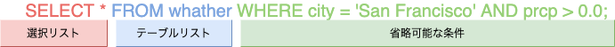

# CRUDの一連の流れを実行する

PostgreSQLの公式ドキュメント：<https://www.postgresql.org/docs/12/tutorial.html>

- PostgreSQL：多機能。
- MySQL：早く作りたい時に

## 1. Getting Started

## 1.1(インストール)

- ソースコード
- インストーラ
- homebrew
- zip

など方法は色々あるらしいですが、今回はhomebrewでインストールします。楽なので。

1. `brew install postgresql`を実行
1. `brew services start postgresql`でPCログイン時に自動起動するようにする。OFFにしたい場合は`start`→`stop`で。
1. `psql -U${USER} postgres`でログイン。`-U${USER}`は環境変数で、インストール時のmacOSログインユーザ名になっている。
1. 👆をそのまま使うのは良くないので、`postgres=# create user postgres with SUPERUSER;`で操作用のユーザ「postgres」を作成。
1. `psql -Upostgres` ログインできるかどうかを確認
1. `\l`でデータベースのリストが取得できたらOK!

## 1.2(構造的な基本事項)

- PostgreSQL（ぽすとぐれすきゅーえる）は、クライアント/サーバモデルを使用している
- セッションは以下の協調動作するプロセスから構成される。
  - サーバプロセス：DBファイルの管理、クライアントアプリケーションからの接続を受け、処理を行う。
  - クライアント：データベース操作を行うフロントアプリケーション。テキスト指向、グラフィカルなもの、色々ある。
- PostgreSQLサーバは、クライアントから複数の同時接続を取り扱うことができる。
- このため、サーバは接続ごとに新しいプロセスを開始（fork）する。
- その時点から、クライアントと新しいサーバプロセスは、元のサーバプロセスによる干渉が無い状態で通信を行える。

　まとめると大体こんな感じ


## 1.3(データベースの作成)

`% createdb mydb`

- 何も出なければOK。この場合だと「mydb」という名前のDBが作成される。
- ユーザ名と同じ名前のDBを作りたい場合は、`createdb`のみでOK。デフォルト値がユーザ名になっているため。
- DB名は、先頭をアルファベット文字から初め、長さは63バイトまでとすること。
- 削除する場合は、`dropdb [DB名]`。物理的に削除するので、取り消せないことに注意。

- トラブルシューティングは[こちら](https://www.postgresql.jp/document/9.2/html/tutorial-createdb.html)

## 1.4(データベースへのアクセス)

`% psql mydb`

```zsh
psql (13.1)
Type "help" for help.

mydb=#
```

- これにより、`mydb`データベースをアクティブにすることが出来る。
- `psql`はPostgreSQL対話式端末プログラム。irb的な。対話式にSQLコマンドの入力、編集、実行を行うことが出来る。
- `mydb=#`が「`#`」になっているのはスーパーユーザだから。それ以外の場合は`mydb=>`となっている。
- `mydb=#`はプロンプト行で、SQL問い合わせを入力できる。例えばこんな感じ。

```zsh
mydb=# SELECT version();
                                                      version
-------------------------------------------------------------------------------------------------------------------
 PostgreSQL 13.1 on x86_64-apple-darwin19.6.0, compiled by Apple clang version 12.0.0 (clang-1200.0.32.27), 64-bit
(1 row)

mydb=# SELECT current_date;
 current_date
--------------
 2021-01-27
(1 row)

mydb=# SELECT 2+2;
 ?column?
----------
        4
(1 row)
```

- psqlは、SQLコマンドではない内部コマンドを持っていて、それらは`\(バックスラッシュ)`から始まる。
- 例えば、`\h`でヘルプ、`\q`で終了。

## 2. The SQL Language

## 2.1(序文)

ユーザ定義の関数と型をコンパイルして、読み込ませる作業。一旦使わなさそうなのでスキップ！🏄

## 2.2(概念)

- PostgreSQLは「リレーショナルデータベースマネジメントシステム(RDBMS)」。
- つまるところ、リレーションの中に格納されたデータを管理するシステム。
- 「リレーション」は「テーブル」を表す数学用語。（そうなんだ）（どういうこと？）
- 「テーブル」は、「行の集合」に名前を付けたもの。
- 「行」は、名前を付けた「列の集合」。
- 「列」は特定のデータ型を持つ。
- 列は行において固定の順番を持つが、SQLはテーブルにある行の順番を全く保証しない。（ソートはする）
- 「テーブル」は「データベース」としてまとめられ、「データベースの集合」は「データベースクラスタ」を構成する。


## 2.3(新しいテーブルの作成)

```zsh
mydb=# CREATE TABLE weather (
    city            varchar(80),
    temp_lo         int,           -- 最低気温
    temp_hi         int,           -- 最高気温
    prcp            real,          -- 降水量
    date            date
);

CREATE TABLE
```

- テーブル名と、テーブルの全ての列の名前と型を指定することで、新しいテーブルを作成することができる。
- psqlは、セミコロンで終わるまでそのコマンドは継続するものと認識する。
- SQLコマンドでは、空白文字（空白、タブ、改行）を自由に使用することが出来る。
- 連続した２つのハイフン（`--`）はコメント。その後に入力したものは、行末まで無視される。
- SQLはキーワードと識別子に対して大文字小文字を区別しない。ただし、識別子が二重引用符でくくられていた場合は区別する。
- テーブルが不要になった場合や別のものに作り直したい場合、`DROP TABLE tablename;`で削除できる。
- `\dt`でテーブル一覧。

```zsh
mydb=# \dt
           List of relations
 Schema |  Name   | Type  |    Owner
--------+---------+-------+-------------
 public | cities  | table | miyasato-pc
 public | weather | table | miyasato-pc
(2 rows)
```

## 2.4(テーブルに行を挿入)

```zsh
mydb=# INSERT INTO weather VALUES('San Francisco',46,50,0.25,'1994-11-27');

INSERT 0 1
```

- INSERT文を用いてテーブルに行を挿入する。
- 単純な数値以外の定数は、上記の例のように単一引用符で括らなければならない。
- 上記の例だと列の順番を覚えておく必要があるが、以下のようにすると、列のリストを明示的に与える事ができる。

```zsh
INSERT INTO weather (city, temp_lo, temp_hi, prcp, date)
    VALUES ('San Francisco', 43, 57, 0.0, '1994-11-29');
```

リスト内の列は順不同。一部の列を省略することも出来る。例えば、降水量`pcrp`がわからない場合は以下のようにする。

```zsh
INSERT INTO weather (date, city, temp_hi, temp_lo)
    VALUES ('1994-11-29', 'Hayward', 54, 37);
```

だいたいみんな列の順番覚えるのダルいので後者でやります。

- 大量のデータを平文テキストファイルからロードすることもできる。INSERT程柔軟性はないが、大量にデータを読み込みたいときにはこちらの方が高速。e.g. `COPY weather FROM '/home/user/weather.txt';`

## 2.5(テーブルへの問合わせ)

```zsh
mydb=# SELECT * FROM weather;

     city      | temp_lo | temp_hi | prcp |    date
---------------+---------+---------+------+------------
 San Francisco |      46 |      50 | 0.25 | 1994-11-27
 Hayward       |      37 |      54 |      | 1994-11-29
 San Francisco |      43 |      57 |    0 | 1994-11-29
(3 rows)
```

- SELECT文を用いてテーブルへ問い合わせをすると、データが取り出せる。上記例だと、weatherの全ての行を取り出すことになる。
- `*`は「全ての列」の省略形で、上記例だと`SELECT city, temp_lo, temp_hi, prcp, date FROM weather;`と同義。
- この文は以下の３つに分ける事ができる。
  - 選択リスト（返される列のリスト部分）
  - テーブルリスト（データを取り出すテーブルのリスト部分）
  - 省略可能な条件（制限を指定する部分）



- 選択リストには、列参照だけでなく、任意の式を指定することが出来る。例えば以下のように、2列の平均を出したい場合など。

```zsh
mydb=# SELECT city, (temp_hi+temp_lo)/2 AS temp_avg, date FROM weather;

     city      | temp_avg |    date
---------------+----------+------------
 San Francisco |       48 | 1994-11-27
 San Francisco |       50 | 1994-11-29
 Hayward       |       45 | 1994-11-29
(3 rows)
```

AS句で算出した値にラベルを付けることも可能。

- WHERE句を追加すると、問い合わせに条件付けをすることができる。
- WHERE句は論理式を持ち、この論理式が真となる行のみを返す。よく使われる論理演算子（AND、OR、NOT）を条件づけに使用出来る。例えば以下だと、San Franciscoの雨天時の気象データを取り出す。

```zsh
mydb=# SELECT * FROM weather
mydb-#    WHERE city = 'San Francisco' AND prcp > 0.0;

         city      | temp_lo | temp_hi | prcp |    date
---------------+---------+---------+------+------------
 San Francisco |      46 |      50 | 0.25 | 1994-11-27
(1 row)

```

- ORDER BY句を用い、問い合わせの結果をソートして返すよう指定することも出来る。

```zsh
mydb=# SELECT * FROM weather
mydb-#   ORDER BY city, temp_lo;

     city      | temp_lo | temp_hi | prcp |    date
---------------+---------+---------+------+------------
 Hayward       |      37 |      54 |      | 1994-11-29
 San Francisco |      43 |      57 |    0 | 1994-11-29
 San Francisco |      46 |      50 | 0.25 | 1994-11-27
(3 rows)
```

- DISTINCT句で、問い合わせの結果から重複行を除くように指定することができる。

```zsh
mydb=# SELECT DISTINCT city
mydb-# FROM weather;
     city
---------------
 Hayward
 San Francisco
(2 rows)
```

## 2.6(テーブル間を結合)

- 一度に同一のテーブルまたは複数のテーブルの複数の行にアクセスする問い合わせを、「結合問い合わせ」と呼ぶ。
- 例として、関連する都市の位置情報を気象データと一緒に表示したい場合が挙げられる。それを行うためには、weatherテーブルの各行のcity列と、citiesテーブルの全ての行のname列を比較し、両者の値が一致する行の組み合わせを選択する。

```zsh
mydb=# SELECT *
mydb-#    FROM weather, cities
mydb-#    WHERE city = name;

     city      | temp_lo | temp_hi | prcp |    date    |     name      | location
---------------+---------+---------+------+------------+---------------+-----------
 San Francisco |      46 |      50 | 0.25 | 1994-11-27 | San Francisco | (-194,53)
 San Francisco |      43 |      57 |    0 | 1994-11-29 | San Francisco | (-194,53)
(2 rows)
```

- Hayward市についての結果がない。これは、citiesテーブルにはHaywardに一致する項目がなく、結合の際にweatherテーブル内の一致しない行は無視されるため。
- 都市名に関する列が２つ出来てしまっている(cityとname)。これはweatherテーブルとcitiesテーブルから列のリストが連結されているため。しかし実際には、これは望ましい結果ではないため、*を使わずに、明示的に出力列のリストを指定することになる。

```zsh
SELECT city, temp_lo, temp_hi, prcp, date, location
    FROM weather, cities
    WHERE city = name;

         city      | temp_lo | temp_hi | prcp |    date    | location
---------------+---------+---------+------+------------+-----------
 San Francisco |      46 |      50 | 0.25 | 1994-11-27 | (-194,53)
 San Francisco |      43 |      57 |    0 | 1994-11-29 | (-194,53)
```

都市名に関する列がcityのみになりました。良い感じ。

- 今回SELECTで指定した列はそれぞれ異なる名前のため、パーサは自動的にどのテーブルの列かを見つけられる。
- しかし、2つのテーブルで列名が重複していた場合は、どちらの列を表示させたいかを示すために、以下のように列名を修飾しなければならない。
- 結合問い合わせでは、すべての列名を以下のように修飾する方式が良いと考えられている。後で重複する名前を持つ列を追加された場合、問い合わせが失敗するためである。

```zsh
SELECT weather.city, weather.temp_lo, weather.temp_hi,
       weather.prcp, weather.date, cities.location
    FROM weather, cities
    WHERE cities.name = weather.city;

```

### 外部結合

- 前項での問い合わせは、以下のような形でも表す事ができる。

```zsh
mydb=# SELECT *
mydb-#    FROM weather INNER JOIN cities ON (weather.city = cities.name);
```

- ここからHaywardのレコードを得るようにするためには、一致しない行があった場合にcitiesテーブルの列の部分を何らかの"空の値"に書き換えなければならない。この種の問い合わせは「外部結合」と呼ばれる。
- LEFT OUTER JOINを用いると、そのような問い合わせが実現できる。これを「左外部結合」と呼ぶ。

```zsh
mydb=#　SELECT *
mydb-#    FROM weather LEFT OUTER JOIN cities ON (weather.city = cities.name);

     city      | temp_lo | temp_hi | prcp |    date    |     name      | location
---------------+---------+---------+------+------------+---------------+-----------
 Hayward       |      37 |      54 |      | 1994-11-29 |               |
 San Francisco |      46 |      50 | 0.25 | 1994-11-27 | San Francisco | (-194,53)
 San Francisco |      43 |      57 |    0 | 1994-11-29 | San Francisco | (-194,53)
(3 rows)
```

- LEFT OUTER JOIN句の右側のテーブルに一致しないような、左側のテーブルの行を出力するとき、右側のテーブルの列は空の値（NULL）で置換される。
- 左外部結合があるということは、右外部結合も完全外部結合もある。


## 2.6(集約関数)

## 2.8(更新)

## 2.9(削除)