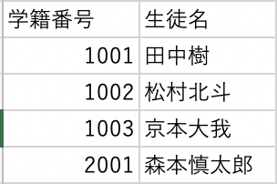
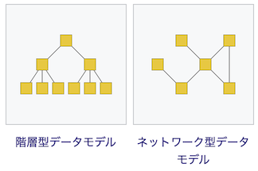

# Relational Databaseとは何か

- 関係モデルに基づいて設計・開発されたデータベース。
- 行と列によって構成された「表形式」のテーブルと呼ばれるデータの集合を、互いに関連付けて関係モデルを使ったデータベースのこと。
- 最も普及しているデータベースシステムの１つ。単に「データベース」と言った場合は、これを指すことが多い。

## Databaseとは

- 検索や蓄積が容易にできるよう整理された**情報の集まり**。
- 通常はコンピュータによって実現されたものを指す。
- 膨大なデータを扱う現代の情報システムでは最重要と言える技術である。
- 例えば、住民基本台帳、銀行の口座情報、検索エンジン、などなど

## Relational Data（関係データモデル）とは

- データの関係によって構造を定義し、その関係の組を、数学の集合論に基づいて扱うことで情報を表現する。
- あらゆるデータはn項の関係（リレーション）で表現される。
- 行（組）、列（属性）、定義域（ドメイン）、主キー（候補キー）、外部キーなどによって構成される。
- 関係に対して、制限、射影、結合、和、差、交わりなどの関係代数演算（集合演算を含む）ないし関係論理演算を行うことで結果を取り出す。

## キーの種類について

| 名前 | 説明 |
| --- | --- |
| 主キー | レコードを一意に特定するためのカラムのこと。 一意制約と非NULL制約を併せ持つ。候補キーの中で最も一行を特定するにふさわしい一組。（複数カラムの組み合わせであることもある）|
| 候補キー | 主キーの候補となるキー。レコードを一意に特定でき、極小である属性またはその組み合わせのこと。NULL許容。 |
| 代理キー| 候補キーの中から主キーに選ばれなかったキーのこと。 |
| 非キー | 候補キー以外のカラムのこと。 |
| 外部キー | 複数のテーブルの関係を結びつけるキーのこと。関係を持った他テーブルの主キーであることが多い。 |

### 具体的に言うと

例えば、「学籍番号」という属性（列）と、「生徒名」という属性（列）の対応を１つの関係として定義し、その関係の組（行）を集めることで「学生名簿」という集合を表せる。

### 他のデータモデル

- 階層型モデル：データを木構造で表したデータモデル。会社の組織図などがそれに当たる。1対多の関係しか存在しない。
- ネットワーク型モデル：各レコードは任意の個数の親レコードと子レコードを持つことが出来、ラティス構造を形成する。
- オブジェクト指向データモデル：オブジェクト指向プログラミングで使うオブジェクトの形式で表現されるデータを扱うデータモデル。

## DBMSとは

- データベース管理システム - Data Base Management Sysyem
- データベースを構築するために必要なデータベース運用、管理のためのシステム、およびそのソフトウェアのこと。
- 実質データベースそのものだと考えても良い。
- MySQL、PostgreSQL、SQLite、MongoDB辺りが有名。

### 主な機能

| 機能名 | 説明 |
| --- | --- |
| データベース言語 | DBMSに対してさまざまな指示を伝えるための言語。「RDBMSならSQL」など、そのデータベースモデルに基づいたDB言語を備えている。DDL（データ構造定義）、DML（データ操作）、DCL（データ制御）の構成要素からなる。 |
| データ完全性 | 不正なデータが登録されることや、不正なデータに更新されることを防ぐ。具体的には一意性制約、データ型（RDBMS）など。 |
| トランザクション処理 | ACID特性に基づいたトランザクション処理を行う。複数のユーザが同時に同一のデータを参照・更新した場合でも、不整合がなく正常に処理こなす、又は異常を通知する。 |
| セキュリティ | 任意アクセス制御もしくは強制アクセス制御を提供し、一部のDBMSではデータの暗号化機能も提供する。DBMSを迂回した不正なデータアクセスへの対策として、DBMSで管理・送受信するデータを暗号化する。|
| 障害復旧 | トランザクション障害、システム障害、記憶媒体の障害からの復旧を行う。|
| 最適化 | 高水準なデータベースモデルを採用するDBMSでは、高水準なDB言語で記述されたデータ処理要求を、低水準な手続きに最適化して実行する。 |
| 分散データベース | ネットワークで接続された複数のコンピュータを使い、それぞれでDBMSのプロセスを協調させて動かし、全体として仮想的に１つのDBMSを実現する技術。可用性や処理性能を向上させることが出来る。 |

## SQLとは

- DBを操作するための言語。Structured Query Language。プログラミング言語ではない。
- 対話型の操作でコンパイル不要。大量のデータを効率よく操作できる。
- SQLでできる操作は以下。
  - データの検索
  - データの追加
  - データの更新
  - データの削除
  - テーブルの作成
  - テーブルの削除
  - テーブルの主キーの設定
  - ユーザー権限の付与
- 主に以下の３つの命令文で構成されている。

### DDL（データ定義言語：Data Definition Language）

- データベースの定義や作成に関わる命令文。
- 「CREATE（DB,テーブル作成）」「DROP（DB,テーブル削除）」「ALTER（DB、テーブル変更）」などがある。

### DML（データ操作言語：Data Manipulation Language）

- データの取得・更新・削除などのデータ操作に関わる命令文。
- 「SELECT（データ取得）」「UPDATE（データ更新）」「DELETE（データ削除）」「INSERT（データ挿入）」などがある。

### DCL（データ制御言語：Data Control Language）

- トランザクションの制御やデータベースへのアクセス制御をするためのコマンド。
- 「BEGIN（トランザクション開始）」「COMMIT（実行した処理の確定）」「ROLLBACK（データの戻し）」などがある。

## テーブル作成に関するルールについて

不正なデータが登録されることや、不正なデータに更新されることを防ぐためのものたち。

### データ型

- テーブルを作成する時、それぞれの列に指定した形式のデータしか入力できないように設定する機能。
- 例えば、char型の列にint型のデータを入力しようとすると、エラーになって入力出来ない。
- 主なデータ型は以下。🐬がMySQL独自、🐘がPostgreSQL独自。

| データ型 | 説明 |
| --- | --- |
| 整数データ型 | |
| int（integer） | 整数 -2147483648～2147483647 |
| 🐬tinyint | とても小さな整数範囲 -128 ～ 127 |
| 🐘smallint | 小さな整数 -32768から+32767 |
| 🐘bigint | 大きな整数 -9223372036854775808から+9223372036854775807 |
| 浮動小数点データ型 | |
| 🐬float | 小さい (単精度) 浮動小数点数  -3.402823466E+38 から -1.175494351E-38、0、および 1.175494351E-38 から 3.402823466E+38 |
| 🐬double | 普通サイズ (倍精度) 浮動小数点数 -1.7976931348623157E+308 から -2.2250738585072014E-308、0、および 2.2250738585072014E-308 から 1.7976931348623157E+308 |
| 🐘real | 6桁精度 |
| 🐘double precision | 15桁精度 |
| 連番型 | テーブルで一意の番号を割り当てるデータ型。 |
| 🐘smallserial | 1から32767 |
| 🐘serial | 1から2147483647 |
| 🐘bigserial | 1から9223372036854775807 |
| 文字列型 |  |
| char(n) | 固定長の文字列 255文字まで。文字列を格納する時に文字数が`n`以下であれば、`n`になるようにスペースが埋め込まれる。`n`を超える文字数を書き込もうとするとエラー。 |
| varchar(n) | 可変長の文字列 255文字まで。 文字列を格納する時に文字数が`n`以下であれば、文字の長さだけ保存される。`n`を超える文字数を書き込もうとするとエラー。|
| text | 長い文字列 65535文字まで |
| 日付・時刻型 |  |
| 🐬date | 日付  ‘1000-01-01’ から ‘9999-12-31’ |
| 🐘date | 4713 BCから5874897 AD |
| 🐬datetime | 日付と時刻 ‘1000-01-01 00:00:00.000000’ から ‘9999-12-31 23:59:59.999999’ |
| 🐬time | 時刻 ‘-838:59:59’ から ‘838:59:59’ |
| 🐘time | 時刻 00:00:00 から 24:00:00 時間帯指定も可|

### 制約

- 多くのアプリケーションでは、型が提供する制約では精密さに欠ける。
- 例えば、製品の情報が入っているテーブルでは、1つの製品番号についての行が2行以上あってはならない…など。
- このような問題を解決するため、SQLでは列及びテーブルに対する制約を定義する事ができる。

| 制約名 | 説明 |
| --- | --- |
| 検査/チェック 制約 | 特定の列の値が条件を満たすように指定できる。`price > 0`で製品価格を必ず正数にする、など。|
| NOT NULL | NULL値を禁止 |
| 一意性制約（UNIQUE KEY） | 重複したデータを禁止。複数の列に使用可能。NULLは許容。 |
| 主キー制約 (PRIMARY KEY) | 重複とNULLを禁止。１つのテーブルに１つだけ。 |
| 参照整合性制約、外部キー制約 (FOREIGN KEY) | 他のテーブルの列を参照し、その列にないデータを禁止。これにより関連する2つのテーブルの参照整合性が維持される。 |
| 排他制御 | 重なりを拒否する制約。値が被ってたらエラーを出してくれる。難しく言うと、２つの行に関して指定された列もしくは式を、指定された演算子で比較した場合に、比較結果のすべてがTRUEを返さないことを保証する。 |

## 参考

- [データモデル - Wikipedia](https://ja.wikipedia.org/wiki/%E3%83%87%E3%83%BC%E3%82%BF%E3%83%A2%E3%83%87%E3%83%AB)
- [関係モデル - Wikipedia](https://ja.wikipedia.org/wiki/%E9%96%A2%E4%BF%82%E3%83%A2%E3%83%87%E3%83%AB)
- [関係データベース - Wikipedia](https://ja.wikipedia.org/wiki/%E9%96%A2%E4%BF%82%E3%83%87%E3%83%BC%E3%82%BF%E3%83%99%E3%83%BC%E3%82%B9)
- [データベースは主キー、外部キー、候補キー、代理キー、複合キーなどキーがいっぱい！ | ITの学び](https://itmanabi.com/db-key/)
- [主キーとは｜「分かりそう」で「分からない」でも「分かった」気になれるIT用語辞典](https://wa3.i-3-i.info/word1991.html)
- [DBの基礎理論（１）【データモデル、関数従属性、キー属性、正規形】 | IT SKILL MAP](https://itskillmap.com/menu4_00/)
- [データベースの基礎【いろんなキー(主キー、候補キー、スーパーキーなど)】 | 釣りキチエンジニアのブログ](https://poppingcarp.com/various_key/)
- [候補キーと主キーの違い : nwdb](https://nwdb.exblog.jp/862558/)
- [オブジェクト指向データベース | IT用語辞典 | 大塚商会](otsuka-shokai.co.jp/words/object-oriented-dtatabase.html)
- [データベース管理システム - Wikipedia](https://ja.wikipedia.org/wiki/%E3%83%87%E3%83%BC%E3%82%BF%E3%83%99%E3%83%BC%E3%82%B9%E7%AE%A1%E7%90%86%E3%82%B7%E3%82%B9%E3%83%86%E3%83%A0)
- [入門者でもわかるSQLを使って表を作ってみよう！【SQ…｜Udemy メディア](https://udemy.benesse.co.jp/development/system/intro-sql.html#:~:text=SQL%E3%81%A8%E3%81%AF%E3%80%81%E3%80%8CStructured%20Query,%E3%81%99%E3%82%8B%E3%81%9F%E3%82%81%E3%81%AE%E8%A8%80%E8%AA%9E%E3%81%A7%E3%81%99%E3%80%82)
- [SQLとは？基礎知識と具体例をわかりやすく解説！](https://products.sint.co.jp/topsic/blog/sql)
- [MySQL:データベースのデータ型とは何か、主なデータ型の種類について説明します | プログラミング入門ナビ](https://blog.proglus.jp/695/)
- [【初心者向け】PostgreSQLで考えるデータ型の種類とは？](https://eng-entrance.com/postgres-sql-data-type)
- [制約](https://www.postgresql.jp/document/pg940doc/html/ddl-constraints.html)
- [CREATE TABLE](https://www.postgresql.jp/document/pg940doc/html/sql-createtable.html#SQL-CREATETABLE-EXCLUDE)
- [SQLの制約の種類とその指定方法 - Qiita](https://qiita.com/Uejun/items/de02b78adbc54868d40d)

## 次：[CRUDをやってみよう](https://github.com/shi6na/Developers-Roadmap/blob/master/06_relational_databases/hands_on.md)
