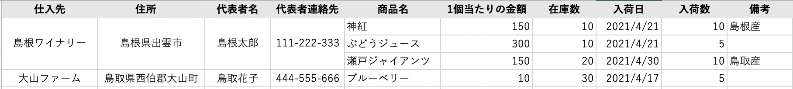
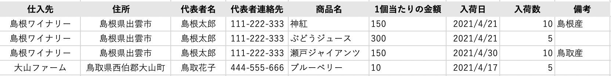
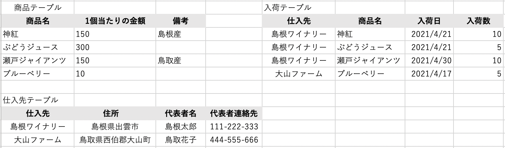

# More about Databases

## ORMs

### ORM：DBを扱いやすくする「プログラミング技法」

オブジェクト関係マッピング（Object-relational Mapping）とは、データベースとオブジェクト指向プログラミング言語間の非互換なデータを変換する「**プログラミング技法**」である。

- 「インピーダンス・ミスマッチ」を解消し、RDBのレコードを直感的に扱えるようにする。
- RDBにアクセスするプログラムを書くときの煩雑な処理を軽減させ、プログラマがSQLを意識することなくコードを書ける。

#### ✔ メリット

- SQLを書かなくても良い（分かりきっていることを何回も書かなくても良い）
- データとオブジェクト（クラス）のマッピングを行わなくても良い
- `book.title #Book Title1`のように、オブジェクト指向の手法で直感的にDB操作を行えるようになる

### 「インピーダンスミスマッチ」とは？

- オブジェクト指向は「現実世界の物事に即したデータモデル」である。

- 関係データベースは「検索やCRUDなどの処理に最適化されたデータモデル」である。

このような設計思想の違いを「**インピーダンス・ミスマッチ**」と呼ぶ。

つまり、オブジェクト指向とデータベースの考えの差分を吸収して、どっちでもいい感じに使えるようにする技法がORM。

### ORMの例

- Acrive Record（Ruby on Rails）
- Eloquent（Laravel）

などが代表的なORM。

例としてAcrive Recordを使うと、以下の仕組みが得られる。

- モデルとそのデータを表す仕組み
- モデル間の関連性を表す仕組み
- 関連するモデルを通した階層の継承を表す仕組み
- DBに保存する前に検証する仕組み
- オブジェクト指向の手法でDB操作を実行する仕組み

クラスとテーブルの対応には、名前に関する規約が利用される。

- テーブル名がBookの場合、クラス名もBook
- 規約通りにクラスを作成すれば、中身が空でも正しくマッピングされる。
- 規約を外れる命令が必要な場合は、クラスに記述を追加すれば良い。

テーブルを作った後のActive Recordの動きは以下。

- ActiveRecordライブラリがDBのスキーマを実行時に読み取る
- カラム名と同じ名前の属性を使えるように、カラムのデータ型に従って、属性が適切なRubyのクラスへの対応付けが行われる。

<!-- 便利だな🎶と思って使っていたが、これが無かったら手動でマッピングしないとオブジェクト操作が出来なかったとは… -->

## Transactions

ソフトウェアの処理方式の1つ。互いに関連・依存する複数の処理をまとめ、**分割できない1つの処理単位**として扱うこと。

- 銀行の口座振込処理など、成功か失敗のどちらかしか許容されない処理を実装する時に使われる。
- 「振り込めた」か「振り込めてない」かの2択しかない。「ちょっとだけ振り込めた」とか無い。

### SQL（PostgreSQL）におけるトランザクションの実装方法

PostgreSQLでは、トランザクションを構成するSQLコマンドを**BEGIN**と**COMMIT**で囲んで設定する。

```zsh
BEGIN;
  構成したいSQL;
COMMIT;
```

例えば、銀行のデータベースで、そこに多数の顧客の口座残高と支店の総預金残高が含まれているとする。

その時、アリスの口座からボブの口座に$100.00の支払いがあったことを記録したい場合、以下のようなSQLになる。

```zsh
UPDATE accounts SET balance = balance - 100.00
    WHERE name = 'Alice';
UPDATE branches SET balance = balance - 100.00
    WHERE name = (SELECT branch_name FROM accounts WHERE name = 'Alice');
UPDATE accounts SET balance = balance + 100.00
    WHERE name = 'Bob';
UPDATE branches SET balance = balance + 100.00
    WHERE name = (SELECT branch_name FROM accounts WHERE name = 'Bob');

```

- これをBEGINとCOMMITで囲んで実行すると、トランザクションが構成される。
- トランザクションの途中で、コミットを行わないと判断（口座残高が足りない場合など）した際は、ROLLBACKを使用して、行われた全ての更新を破棄するようになっている。

A. トランザクションが成功した場合

```zsh
mydb=# BEGIN;
BEGIN
mydb=*# UPDATE accounts SET balance = balance - 100.00
    WHERE name = 'Alice';
UPDATE branches SET balance = balance - 100.00
    WHERE name = (SELECT branche_name FROM accounts WHERE name = 'Alice');
UPDATE accounts SET balance = balance + 100.00
    WHERE name = 'Bob';
UPDATE branches SET balance = balance + 100.00
    WHERE name = (SELECT branche_name FROM accounts WHERE name = 'Bob');
UPDATE 1
UPDATE 1
UPDATE 1
UPDATE 1
mydb=*# COMMIT;
COMMIT
mydb=# SELECT * FROM accounts;
 name  | balance | branche_name
-------+---------+---------------
 Alice |     100 | Hayward
 Bob   |     300 | San Francisco
(2 rows)
```

B. 失敗した場合（Aliceの口座残高が不足していた場合）

```zsh
mydb=# BEGIN;
BEGIN
mydb=*# UPDATE accounts SET balance = balance - 100.00
    WHERE name = 'Alice';
UPDATE branches SET balance = balance - 100.00
    WHERE name = (SELECT branche_name FROM accounts WHERE name = 'Alice');
UPDATE accounts SET balance = balance + 100.00
    WHERE name = 'Bob';
UPDATE branches SET balance = balance + 100.00
    WHERE name = (SELECT branche_name FROM accounts WHERE name = 'Bob');
ERROR:  new row for relation "accounts" violates check constraint "accounts_balance_check"
DETAIL:  Failing row contains (Alice, 0, Hayward).
ERROR:  current transaction is aborted, commands ignored until end of transaction block
ERROR:  current transaction is aborted, commands ignored until end of transaction block
ERROR:  current transaction is aborted, commands ignored until end of transaction block
mydb=!# COMMIT;
ROLLBACK
```

#### 余談

- PostgreSQLは実際、すべてのSQL命令文をトランザクション内で実行するようになっている。
- BEGINを書かずとも、それぞれの命令文は暗黙的なBEGINがついているとみなし、成功すればCOMMITで囲まれたものとしている。

### FW（Ruby on Rails）におけるトランザクションの実装方法

```ruby
ActiveRecord::Base.transaction do
  例外が発生するかもしれない処理
end
  例外が発生しなかった場合の処理
resque => e
  例外が発生した場合の処理
```

```ruby
モデル.transaction do
  例外が発生するかもしれない処理
end
  例外が発生しなかった場合の処理
resque => e
  例外が発生した場合の処理
```

railsにおいては、上記の方法でトランザクションを実装することが出来る。

#### ✔ 特徴

- ブロック内の全ての処理が正常に行われた場合に保存が行われる
- エラーが発生した場合は、ロードバックをする
- 複数のデータベースにまたがる分散トランザクションはサポートしていない
- 使用するにはDBがトランザクションをサポートしていることが必要

以下、rails consoleでUserモデルを用いて実際にトランザクション処理を行ってみた結果。

A. 処理成功する場合🎉

```irb
irb(main):001:1> User.transaction do
irb(main):002:1*   a1 = User.new(name: 'tarou', email: 'tarou@email.com')
irb(main):003:1>   a1.save!
irb(main):004:1>   a2 = User.new(name: 'jurou', email: 'jirou@email.com')
irb(main):005:1>   a2.save!
irb(main):006:1> end
   (0.7ms)  SELECT sqlite_version(*)
   (0.0ms)  begin transaction
  User Create (0.7ms)  INSERT INTO "users" ("name", "email", "created_at", "updated_at") VALUES (?, ?, ?, ?)  [["name", "tarou"], ["email", "tarou@email.com"], ["created_at", "2021-03-01 06:09:48.910751"], ["updated_at", "2021-03-01 06:09:48.910751"]]
  User Create (0.1ms)  INSERT INTO "users" ("name", "email", "created_at", "updated_at") VALUES (?, ?, ?, ?)  [["name", "jurou"], ["email", "jirou@email.com"], ["created_at", "2021-03-01 06:09:48.917575"], ["updated_at", "2021-03-01 06:09:48.917575"]]
   (0.5ms)  commit transaction
=> true
```

B. 失敗する場合（emailが未入力）

```irb
irb(main):007:0> User.transaction do
irb(main):008:1*   a1 = User.new(name: 'tarou', email: 'tarou@email.com')
irb(main):009:1>   a1.save!
irb(main):010:1>   a2 = User.new(name: 'jurou')
irb(main):011:1>   a2.save!
irb(main):012:1> end
   (0.1ms)  begin transaction
  User Create (0.4ms)  INSERT INTO "users" ("name", "email", "created_at", "updated_at") VALUES (?, ?, ?, ?)  [["name", "tarou"], ["email", "tarou@email.com"], ["created_at", "2021-03-01 06:10:35.460856"], ["updated_at", "2021-03-01 06:10:35.460856"]]
   (0.3ms)  rollback transaction
Traceback (most recent call last):
        2: from (irb):7
        1: from (irb):11:in `block in irb_binding'
ActiveRecord::RecordInvalid (Validation failed: Email can't be blank)
```

### ロールバックて何よ

- データ更新などで障害が起こった時に、**その前の状態にまで戻ること**を言う。後進復帰とも。
- 障害発生時に、処理途中で確約されていないトランザクションの処理をすべて取り消し、最初の時点に戻す。

## ACID

信頼性のあるトランザクションシステムの持つべき性質として定義された概念。以下4つの性質の頭文字を取ったもの。

**A**tomicity：不可分性

**C**onsistency：一貫性

**I**solation：独立性

**D**urability：永続性

### **A**tomicity：不可分性

トランザクションに含まれるタスクが全て実行されるか、あるいは全く実行されないことを保証する性質を言う。

「**原子性**」とも呼ばれる。

#### 例

口座AB間で送金が行われる際、送金操作は以下の2操作によって行われる。

- 口座Aの残高から1万円引く
- 口座Bの残高に1万円加える

「不可分性が保証される」とは、上記2操作が**全て行われる**か、あるいは**全く行われない**ことを指す。

### **C**onsistency：一貫性

トランザクション開始と終了時にあらかじめ与えられた整合性を満たすことを保証する性質を指す。

→ つまり、条件や整合性を満たさない状態になるようなトランザクションは実行が中断される。

#### 例

- 預金残高は、一般的に0または正の値を取る条件を満たす必要がある。
- 口座Aから送金を行うとき、その前後でAの口座残高が負になるような額は送金できないようにする。

### **I**solation：独立性

- 処理の過程が、他の操作から隠蔽されること。
- 処理の結果だけが他から見ることができ、実行中の途中状態が他へ影響することが無いということ。

#### 例

- 残高100万円の口座Aから、残高200万円の口座Bに1万円送金する場合の操作が以下の順序で行われたとする。

1. 口座Aの残高から1万円を引く
1. 口座Bの残高に1万円を加える

この時、内部状態として取り得るのは以下の３つになる。

| 時点 | 口座A | 口座B |
| --- | --- | --- |
| 送金前 | 100万円 | 200万円 |
| 実行中 | 99万円 | 200万円 |
| 送金後 | 99万円 | 201万円 |

独立性が保証されている場合は、外部からは**送金前**と**送金後**のいずれかの状態しか観測できない。

### **D**urability：永続性（耐久性）

処理の完了通知をユーザが受けた時点で、その操作は永続的なものとして、データベースに記録されていることを指す。

- ≒「システム障害に耐える」。
- 処理を永続性記憶装置（不揮発性メモリ。HDD、CDなど）上にログとして記録し、システムに異常が発生した場合、そのログを用いて異常発生前の状態まで復旧する。

### それぞれの性質を実現させる代表的な機能

| 性質 | 機能 | 概要 |
| --- | --- | --- |
| 原子性 | コミットメント制御 | コミット機能とロールバック機能のこと。コミット機能とは、トランザクション処理が全て実行された時、その**処理結果を確定させ、データを更新する**機能。|
| 一貫性・独立性 | 排他制御 | 共有資源に対しての複数同時アクセスにより不整合が発生することを防ぐため、あるトランザクションが共有資源にアクセスしている時は、他トランザクションからはアクセスできないようにして直列に処理されるように制御すること。 |
| 永続性 | 障害回復機能 | バックアップやリストア機能など、障害発生時に、障害発生前まで回復させる機能のこと。 |

## CAP Theorem：CAP定理

分散コンピュータシステムのコンピュータ間の情報複製において、

- 一貫性：**C**onsistency
- 可用性：**Av**ailability
- ネットワーク分断耐性：**P**artition-tolerance

この3つの保証のうち、同時に満たせるのは2つまでであり、同時に全てを満たすことは出来ない、という定理。ブリュワーの定理とも。

保証はそれぞれ以下を意味している。

1. 一貫性：誰かがデータを更新したら必ず更新後のデータを参照できること
1. 可用性：クライアントは必ずデータにアクセスできること
1. ネットワーク分断耐性：データを複数のサーバに分散保管できること

２つの保証を取った時、除かれる要素に応じて「CA」「CP」「AP」の3種類に分類される。

- CA：単一サーバで動作するDB（RDBなど）
- CP：分散データベース
- AP：DNS、NTP、HTTPキャッシュ

などのシステムに用いられることが多い。3種の中ではAPが最も障害に強い。

例えば、「その単一箇所が働かないと、システム全体が障害となるような箇所（単一故障点）」があった時のCAP定理での考え方は以下になる。
> ネットワーク分断が発生した際にシステムがバラバラに分裂しても、単一故障点を基準に一貫した応答が出来る（分断耐性＋一貫性）が、可用性が成立しなくなる。

## Data replication

- 本番系のデータを予備系のシステムにリアルタイムに複製すること。
- これにより、本番系が障害で停止しても、予備系のシステムでサービスを継続できる。
- 信頼性やフォールトトレラント性（高可用性）、アクセス容易性を強化するもの。
- レプリケーションを用意することを「冗長化」という。

※ フォールトトレラント性とは、システムの一部に問題が生じても全体が機能停止するということなく動作し続けること。

### バックアップとの違い

| | レプリケーション | バックアップ |
| --- | --- | --- |
| 更新 | リアルタイム | 定期的 |
| 復旧 | 同じシステム間 | 異なる媒体(テープ、ストレージ) |
| 障害発生時 | 継続 | 再開 |

- レプリケーションのみで運用すると、データが壊された時やウイルスに感染した時に、そのままレプリケーションされてしまう。
- そのため、バックアップと併せて利用するのが理想的。

### 可用性（稼働率）

- システムが停止することなく稼働し続ける能力。
- 例えば、80時間に一度障害が発生して停止するシステムがあって、再稼働に20時間かかるとしたら、このシステムの可用性は 80%になる。
- AWSの可用性は99.9%って木村さんが言ってました。（95%以下になったら全額返してくれるらしい）

### スケールアウト

- コンピュータの台数を増やすことでシステム全体の性能を向上させること。コンピュータシステムの性能を増強する手法の一つ。
- 同じ構成・機能のコンピュータを複数台設置し、処理を分担することにより実現される。
- 類似したものとして、構成部品を増設・交換して性能増強する手法は「スケールアップ」と呼ぶ。
- レプリケーションは、DBでのスケールアウトを実現するためのもの。

## Sharding Strategies

> shard：陶片。陶器などの破片のこと。

- データを複数のディスクに分割配置する。データベースにおける負荷分散方法の一種。水平分割とも。
- 同じテーブルを複数のデータベースに用意し、1つのテーブルに保存していたレコードを分散する。
- データベースへのリクエストを分散し、全体のスループットを上げる目的で利用される。


### 気をつけること

- 他テーブルとのJOINが難しい
- シャーディングの分割対象にした値以外での検索が難しくなる

### スループット

- 単位時間当たりに処理できる仕事量のこと。
- コンピュータシステムが単位時間に実行出来る処理の件数や、通信回線の単位時間あたりの実行伝送量などを意味することが多い。

### テーブルシャーディング

- 同じDB内で同じカラム構成のテーブルを複数用意し、分散の対象の値をテーブル名に入れることで1テーブル内のデータ量を分散する。
- テーブルとのJOINがどうしても必要で、シャーディングをしなければならない場合に有効。
- なお、「シャーディング」といえば基本複数DBに同じテーブルを作成する前述の方法（DBシェーディング）が主流。

### 余談

- [InstagramのDBもシャーディングしてるらしい](https://siguniang.wordpress.com/2013/01/23/sharding-ids-at-instagram/)

## N + 1 Probrem

- N個の集約が与えられた時、集約自身を得るクエリ1つと、その関連を辿るクエリN個を足した N+1 のクエリを発行してしまう問題。
- 例えば、1度Userモデル全部のデータを取ってきた後、Userに紐付いているPostモデルのデータをループ処理で取得すると、1+N回クエリが発行されてしまい、大量になると、パフォーマンスが落ちてしまう。1+N問題とも。
- N+1問題が発生するような方法のことを「Lazy loading」と呼ぶ。関連を参照するまで遅延読み込みすることから。
- 機能的な不具合ではないところが嫌。開発時のデータが少ない段階では気付きづらく、データ量の多い本番環境にリリースした後に気付くことがしばしば…。

### 回避策1：Eager loading(即時読み込み)

- 指定されたassociationをLEFT OUTER JOINで引っ張ってきてキャッシュする。
- 発行されるSQLの数が1つで済む。が、キャッシュ分はメモリを消費する。

※ association：関連付けが行われたモデル同士のこと。ブログのUserとPostとか。

### 回避策2：preload

- 指定したassociationを複数のクエリに分けて引っ張ってきてキャッシュする。
- 複数のassociationをeager loadingするときか、あまりJOINしたくない大きいテーブルを扱う時におすすめ。

### 回避策2：join

- 普通にJOINを行うだけ。
- 上記と違うのは、キャッシュをしないこと。メモリの消費が抑えられる。
- JOINして条件を絞り込みたいけど、JOINするテーブルのデータは使わない、てな時におすすめ。

### Q.じゃあ常にLazy Loadingを避けてEager loadingをしていれば良いのか

- A.そうでもない。
- 例えば、集約の一部の関連しか参照しない場合、Eager loadingをすると無駄なクエリの発行になってしまうが、Lazy loadingをすればクエリの発行自体を抑えられるため、パフォーマンスでは有利になる。
- ただ、N+1問題が起こってしまうリスクはある。そのため、N+1問題が起こらないようにLazy loadingを実装すれば良い。
- つまり、エンティティごとに個別に読み込みを遅延するのではなく、関連ごとに遅延すればいい。

## Database Nomalization

- リレーションを一定のルールに基づいて変形し、利用しやすくすること。
- 正規形ではないものを、比較・演算などの操作のために望ましい性質を持った一定の形（=正規形）に変形することをいう。
- 正規形であるためには、ある時点での値がその定義に当てはまるだけではなく、今後そのテーブルの行に増減があっても、定義から外れることがないように属性が定義されていることが必要。
- データの一貫性の維持と、効率的なデータアクセスを可能にする関係設定を導くための手法であり、データの冗長性と不整合が起きる機会を減らすことが出来る。
- 完全に正規化されたDBへのクエリは効率が悪い場合がある。効率を向上させるために、データの一貫性の低下と引き換えに、あえて非正規化されることもある。

### 非正規系

- 正規化が行われておらず、1行の中に複数の繰り返し項目が存在するようなテーブルのこと。



### 第1正規化

- リレーションがそれ以上分割できない値のみを所持するとき（→繰返し項目を所持しない場合）、その関係を第1正規形という。
- 簡単に言うと、一つのカラムに一つの値のみ設定されている状態のこと。
- また、他のカラムから導出可能な項目も、この段階で削除しておく。
- 最低限この形式にすることで、DBに格納できるようになる。



### 第2正規化

- レコードを一意に決める要素「主キー」を見つけ出し、その主キーの一部の要素だけで決まる（部分関数従属）項目を別テーブルに分離させる（完全関数従属の形にする）。
- 「〇〇がわかれば△△もわかる」を目印に部分関数従属を見つける。
- 今回の主キーは「仕入先」「商品名」「入荷日」。それぞれの項目に依存するのは以下の通り
  - 仕入先：住所、代表者名、代表者連絡先
  - 商品名：1個あたりの金額、備考
  - 仕入先、商品名、入荷日：入荷数

なので、商品テーブル、入荷テーブル、仕入先テーブルの3つに分ける。



### 第3正規化

- 非キー（主キー以外）で決まる項目（推移関数従属）を別テーブルに移動させる。推移関数従属性が存在しない状態。
- 今回だと、非キーである代表者名から代表者連絡先がわかる推移関数従属性が仕入先テーブルにあるため、これを電話帳という別テーブルに移動させる。


### まとめ

- 第1正規形
  - 繰返し項目を持たない
  - 導出項目を持たない

- 第2正規形
  - 第1正規形を満たしている
  - 主キーに対して、すべての非キー属性が完全関数従属

- 第3正規形
  - 第2正規形を満たしている
  - 全ての非キー属性がどの候補キーに対しても推移的に関数従属していない

## Index and how they work

## 参考文献

- [オブジェクト関係マッピング - Qiita](https://qiita.com/yk-nakamura/items/acd071f16cda844579b9)
- [オブジェクト関係マッピング - Wikipedia](https://ja.wikipedia.org/wiki/%E3%82%AA%E3%83%96%E3%82%B8%E3%82%A7%E3%82%AF%E3%83%88%E9%96%A2%E4%BF%82%E3%83%9E%E3%83%83%E3%83%94%E3%83%B3%E3%82%B0)
- [O/Rマッパーを使う理由 - ぺい](https://tikasan.hatenablog.com/entry/2018/08/06/110000)
- [transaction | Railsドキュメント](https://railsdoc.com/page/transaction)
- [トランザクションとは - IT用語辞典 e-Words](https://e-words.jp/w/%E3%83%88%E3%83%A9%E3%83%B3%E3%82%B6%E3%82%AF%E3%82%B7%E3%83%A7%E3%83%B3.html)
- [トランザクション](https://www.postgresql.jp/document/9.4/html/tutorial-transactions.html)
- [ACID特性とは何？ Weblio辞書](https://www.weblio.jp/content/ACID%E7%89%B9%E6%80%A7)
- [排他制御（楽観ロック・悲観ロック）の基礎　 - Qiita](https://qiita.com/NagaokaKenichi/items/73040df85b7bd4e9ecfc)
- [原子性を実現する「コミットメント制御」を理解する：「データベーススペシャリスト試験」戦略的学習のススメ（22） - ＠IT](https://www.atmarkit.co.jp/ait/articles/1703/01/news195.html)
- [耐久性を確保する「障害回復機能」を理解する：「データベーススペシャリスト試験」戦略的学習のススメ（25） - ＠IT](https://www.atmarkit.co.jp/ait/articles/1703/01/news198.html)
- [ACID (コンピュータ科学) - Wikipedia](https://ja.wikipedia.org/wiki/ACID_(%E3%82%B3%E3%83%B3%E3%83%94%E3%83%A5%E3%83%BC%E3%82%BF%E7%A7%91%E5%AD%A6))
- [データレプリケーションとは？ メリットは？｜ITトレンド](https://it-trend.jp/data-replication/article/explain)
- [フォールトトレラント設計 - Wikipedia](https://ja.wikipedia.org/wiki/%E3%83%95%E3%82%A9%E3%83%BC%E3%83%AB%E3%83%88%E3%83%88%E3%83%AC%E3%83%A9%E3%83%B3%E3%83%88%E8%A8%AD%E8%A8%88)
- [レプリケーション - Wikipedia](https://ja.wikipedia.org/wiki/%E3%83%AC%E3%83%97%E3%83%AA%E3%82%B1%E3%83%BC%E3%82%B7%E3%83%A7%E3%83%B3)
- [そもそも可用性とは何か？可用性を高める方法とは？ | ビジネス継続とITについて考える](https://bcblog.sios.jp/what-is-availability/)
- [スケールアウトとは - IT用語辞典 e-Words](https://e-words.jp/w/%E3%82%B9%E3%82%B1%E3%83%BC%E3%83%AB%E3%82%A2%E3%82%A6%E3%83%88.html)
- [シャーディング - Qiita](https://qiita.com/hharu/items/15627d2058bffe1fadf0)
- [シャーディングとは、テーブルシャーディングという可能性【水平分割】 | SEO対策なら株式会社ペコプラ](https://pecopla.net/web-column/db-shard)
- [ActiveRecordのjoinsとpreloadとincludesとeager_loadの違い - Qiita](https://qiita.com/k0kubun/items/80c5a5494f53bb88dc58)
- [集約の実装とLazy Loading - emonkak's Blog](https://emonkak.hatenablog.com/entry/2017/10/01/113453)
- [Railsライブラリ紹介: N+1問題を検出する「bullet」 | TECHSCORE BLOG](https://www.techscore.com/blog/2012/12/25/rails%E3%83%A9%E3%82%A4%E3%83%96%E3%83%A9%E3%83%AA%E7%B4%B9%E4%BB%8B-n1%E5%95%8F%E9%A1%8C%E3%82%92%E6%A4%9C%E5%87%BA%E3%81%99%E3%82%8B%E3%80%8Cbullet%E3%80%8D/)
